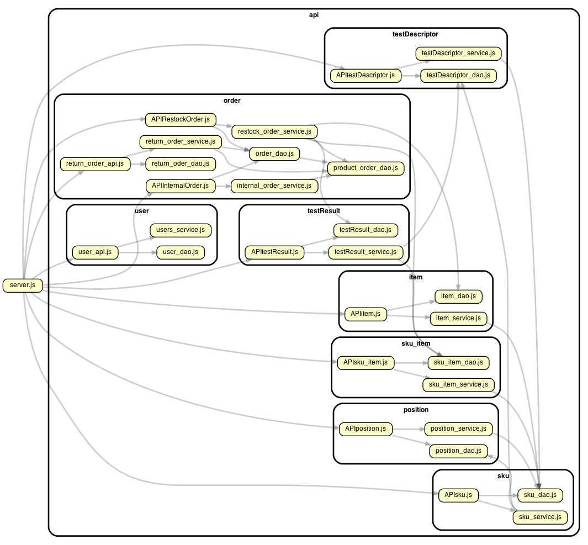

# Integration and API Test Report

Date:21/06/2022

Version: 1.8

# Contents

- [Dependency graph](#Dependency-graph)

- [Integration approach](#integration-approach)

- [Tests](#integration-tests)

- [Scenarios](#api-testing---scenarios)

- [Coverage of scenarios and FR](#coverage-of-scenarios-and-fr)
- [Coverage of non-functional requirements](#coverage-of-non-functional-requirements)

# Dependency graph

# Integration approach

    The integration approach we adopted is bottom-up. We started with unit-testing, where we tested all the leaf classes and their methods relatives to the interaction with database (SQLiteDB). These test are reported and commented in UnitTestReport.md file. After that we proceeded to test all services classes which correspond to the middleware of the application. At the end there is the API testing, which consist in testing the api function call.

# Integration Tests

<define below a table for each integration step. For each integration step report the group of classes under test, and the names of
Jest test cases applied to them, and the mock ups used, if any> Jest test cases should be here code/server/unit_test

## Step 1

| Classes            | Jest test cases                                                        |
| ------------------ | ---------------------------------------------------------------------- |
| internal_order_dao | internal_order_dao.test.js -> testNewInternalOrder                     |
| internal_order_dao | internal_order_dao.test.js -> testGetAllInternalOrders                 |
| internal_order_dao | internalAccepted_order_dao.test.js -> testUpdateStateOrder             |
| internal_order_dao | internalAccepted_order_dao.test.js -> testGetAllInternalAcceptedOrders |
| internal_order_dao | internal_order_dao.test.js -> testGetInternalOrderById                 |
| internal_order_dao | internal_order_dao.test.js -> testDeleteOrder                          |
| testDescriptor_dao | testDescriptor_dao.test.js -> testNewTestDescriptor                    |
| testDescriptor_dao | testDescriptor_dao.test.js -> testGetTestDescriptors                   |
| testDescriptor_dao | testDescriptor_dao.test.js -> testGetSpecificTD                        |
| testDescriptor_dao | testDescriptor_dao.test.js -> testUpdateTestDescriptor                 |
| testDescriptor_dao | testDescriptor_dao.test.js -> testDeleteTestDescriptor                 |
| testResult_dao     | testResult_dao.test.js -> testNewTestResult                            |
| testResult_dao     | testResult_dao.test.js -> testGetTestResults                           |
| testResult_dao     | testResult_dao.test.js -> testGetSpecificTR                            |
| testResult_dao     | testResult_dao.test.js -> testUpdateTestResult                         |
| testResult_dao     | testResult_dao.test.js -> testDeleteTestResult                         |
| item_dao           | item_dao.test.js -> testNewItem                                        |
| item_dao           | item_dao.test.js -> testGetItems                                       |
| item_dao           | item_dao.test.js -> testGetSpecificItem                                |
| item_dao           | item_dao.test.js -> testUpdateItem                                     |
| item_dao           | item_dao.test.js -> testDeleteItem                                     |
| sku_dao            | sku_dao.test.js -> testGetAllSku                                       |
| sku_dao            | sku_dao.test.js -> testGetSkuById                                      |
| sku_dao            | sku_dao.test.js -> testNewSku                                          |
| sku_dao            | sku_dao.test.js -> testUpdateSku                                       |
| sku_dao            | sku_dao.test.js -> testDeleteSku                                       |
| sku_dao            | sku_dao.test.js -> testUpdatePositionData                              |
| sku_item_dao       | sku_item_dao.test.js -> testGetAllSkuItems                             |
| sku_item_dao       | sku_item_dao.test.js -> testGetSkuItemsBySkuId                         |
| sku_item_dao       | sku_item_dao.test.js -> testGetSkuItemByRFID                           |
| sku_item_dao       | sku_item_dao.test.js -> testNewSkuItem                                 |
| sku_item_dao       | sku_item_dao.test.js -> testUpdateSkuItem                              |
| sku_item_dao       | sku_item_dao.test.js -> testUpdateOrderIdSkuItem                       |
| sku_item_dao       | sku_item_dao.test.js -> testDeleteSkuItem                              |
| position_dao       | position_dao.test.js -> testGetAllPosition                             |
| position_dao       | position_dao.test.js -> testGetPositionById                            |
| position_dao       | position_dao.test.js -> testNewPosition                                |
| position_dao       | position_dao.test.js -> testUpdatePosition                             |
| position_dao       | position_dao.test.js -> testUpdatePositionOccupation                   |
| position_dao       | position_dao.test.js -> testUpdatePositionID                           |
| position_dao       | position_dao.test.js -> testDeletePosition                             |
| user_dao           | user_service.test.js -> testGetAllUsers                                |
| user_dao           | user_service.test.js -> testUsersByType                                |
| user_dao           | user_service.test.js -> testGetSuppliers                               |
| user_dao           | user_service.test.js -> testUpdateType                                 |
| user_dao           | user_service.test.js -> testDeleteUser                                 |
|return_order_dao, product_order_dao, order_dao| return_order_service.test.js -> testNewReturnOrder|
|return_order_dao, product_order_dao, order_dao| return_order_service.test.js -> testGetReturnOrders|
|return_order_dao, product_order_dao, order_dao| return_order_service.test.js -> testGetReturnOrderById|
|return_order_dao, product_order_dao, order_dao| return_order_service.test.js -> testDeleteReturnOrder|

## Step 2

| Classes                | Jest test cases                                                    |
| ---------------------- | ------------------------------------------------------------------ |
| internal_order_service | internal_order_service.test.js -> testNewInternalOrder             |
| internal_order_service | internal_order_service.test.js -> testGetAllInternalOrders         |
| internal_order_service | internal_order_service.test.js -> testGetAllInternalIssuedOrders   |
| internal_order_service | internal_order_service.test.js -> testUpdateStateOrder             |
| internal_order_service | internal_order_service.test.js -> testGetAllInternalAcceptedOrders |
| internal_order_service | internal_order_service.test.js -> testGetInternalOrder             |
| internal_order_service | internal_order_service.test.js -> testDeleteOrder                  |
| restock_order_service  | restock_order_service.test.js -> testNewRestockOrder               |
| restock_order_service  | restock_order_service.test.js -> testGetAllRestockOrder            |
| restock_order_service  | restock_order_service.test.js -> testGetAllRestockIssuedOrder      |
| restock_order_service  | restock_order_service.test.js -> testUpdateStateOrder              |
| restock_order_service  | restock_order_service.test.js -> testGetRestockOrderById           |
| restock_order_service  | restock_order_service.test.js -> testAddTransportNote              |
| restock_order_service  | restock_order_service.test.js -> testAddSkuItems                   |
| restock_order_service  | restock_order_service.test.js -> testDeleteOrder                   |
| testDescriptor_service | testDescriptor_service.test.js -> testNewTestDescriptor            |
| testDescriptor_service | testDescriptor_service.test.js -> testGetTestDescriptors           |
| testDescriptor_service | testDescriptor_service.test.js -> testUpdateTestDescriptor         |
| testDescriptor_service | testDescriptor_service.test.js -> testDeleteTestDescriptor         |
| testResult_service     | testResult_service.test.js -> testNewTestResult                    |
| testResult_service     | testResult_service.test.js -> testGetTestResults                   |
| testResult_service     | testResult_service.test.js -> testUpdateTestResult                 |
| testResult_service     | testResult_service.test.js -> testDeleteTestResult                 |
| item_service           | item_service.test.js -> testNewItem                                |
| item_service           | item_service.test.js -> testGetItems                               |
| item_service           | item_service.test.js -> testDeleteItem                             |
| item_service           | item_service.test.js -> testUpdateItem                             |
| sku_service            | sku_service.test.js -> testGetSku                                  |
| sku_service            | sku_service.test.js -> testUpdateSku                               |
| sku_service            | sku_service.test.js -> testDeleteSku                               |
| sku_service            | sku_service.test.js -> testPutPosition                             |
| sku_item_service       | sku_item_service.test.js -> testNewGetSkuItem                      |
| sku_item_service       | sku_item_service.test.js -> testUpdateSkuItem                      |
| sku_item_service       | sku_item_service.test.js -> testDeleteSkuItem                      |
| position_service       | position_service.test.js -> testNewPosition                        |
| position_service       | position_service.test.js ->                                        |
| testUpdatePosition     |
| position_service       | position_service.test.js ->                                        |
| testUpdatePositionID   |
| position_service       | position_service.test.js -> testDeletePosition                     |
| position_service       | position_service.test.js -> testGetSkuByPosition                   |
| users_service          | user_service.test.js -> testGetAllUsers                            |
| users_service          | user_service.test.js -> testUsersByType                            |
| users_service          | user_service.test.js -> testGetSuppliers                           |
| users_service          | user_service.test.js -> testUpdateType                             |
| users_service          | user_service.test.js -> testDeleteUser                             |
| return_order_service   | return_order_service.test.js -> testNewReturnOrder                 |
| return_order_service   | return_order_service.test.js -> testGetReturnOrders                |
| return_order_service   | return_order_service.test.js -> testGetReturnOrderById             |
| return_order_service   | return_order_service.test.js -> testDeleteReturnOrder              |

## Step 3

| Classes           | Mocha test cases                                                  |
| ----------------- | ----------------------------------------------------------------- |
| ApiInternalOrder  | api_internal_order.js -> testPostInternalOrder                    |
| ApiInternalOrder  | api_internal_order.js -> testGetAllInternalOrder                  |
| ApiInternalOrder  | api_internal_order.js -> testGetAllInternalIssuedOrder            |
| ApiInternalOrder  | api_internal_order.js -> testGetAllInternalAcceptedOrder          |
| ApiInternalOrder  | api_internal_order.js -> testGetInternalOrder                     |
| ApiInternalOrder  | api_internal_order.js -> testUpdateStateOrder                     |
| ApiInternalOrder  | api_internal_order.js -> testDeleteOrder                          |
| ApiRestockOrder   | api_restock_order.js -> testPostRestockOrder                      |
| ApiRestockOrder   | api_restock_order.js -> testGetAllRestockOrders                   |
| ApiRestockOrder   | api_restock_order.js -> testGetALlRestockIssuedOrders             |
| ApiRestockOrder   | api_restock_order.js -> testGetRestockOrderById                   |
| ApiRestockOrder   | api_restock_order.js -> testAddTransportNote                      |
| ApiRestockOrder   | api_restock_order.js -> testAddTransportNoteInvalidState          |
| ApiRestockOrder   | api_restock_order.js -> testAddSkuItemsToRestockOrder             |
| ApiRestockOrder   | api_restock_order.js -> testAddSkuItemsToRestockOrderInvalidState |
| ApiRestockOrder   | api_restock_order.js -> testDeleteOrder                           |
| ApiSku            | api_sku.js -> testPostSku                                         |
| ApiSku            | api_sku.js -> testGetAllSku                                       |
| ApiSku            | api_sku.js -> testGetSkuById                                      |
| ApiSku            | api_sku.js -> testUpdateSku                                       |
| ApiSku            | api_sku.js -> testUpdateSkuPosition                               |
| ApiSku            | api_sku.js -> testDeleteSku                                       |
| ApiSkuItem        | api_sku_item.js -> testPostSkuItem                                |
| ApiSkuItem        | api_sku_item.js -> testGetSkuItems                                |
| ApiSkuItem        | api_sku_item.js -> testGetSkuItemsBySkuId                         |
| ApiSkuItem        | api_sku_item.js -> testGetSkuItemByRFID                           |
| ApiSkuItem        | api_sku_item.js -> testUpdateSkuItem                              |
| ApiSkuItem        | api_sku_item.js -> testDeleteSkuItem                              |
| ApiPosition       | api_position.js -> testPostPosition                               |
| ApiPosition       | api_position.js -> testGetPosition                                |
| ApiPosition       | api_position.js -> testUpdatePosition                             |
| ApiPosition       | api_position.js -> testUpdatePositionID                           |
| ApiPosition       | api_position.js -> testDeletePosition                             |
| ApiTestDescriptor | api_testDescriptor.test.js -> testPostTestDescriptor              |
| ApiTestDescriptor | api_testDescriptor.test.js -> testGetAllTestDescriptor            |
| ApiTestDescriptor | api_testDescriptor.test.js -> testGetTestDescriptorById           |
| ApiTestDescriptor | api_testDescriptor.test.js -> testUpdateTestDescriptor            |
| ApiTestDescriptor | api_testDescriptor.test.js -> testDeleteTestDescriptor            |
| ApiTestResult     | api_testResult.test.js -> testPostTestResult                      |
| ApiTestResult     | api_testResult.test.js -> testGetAllTestResult                    |
| ApiTestResult     | api_testResult.test.js -> testGetTestResultById                   |
| ApiTestResult     | api_testResult.test.js -> testUpdateTestResult                    |
| ApiTestResult     | api_testResult.test.js -> testDeleteTestResult                    |
| ApiItem           | api_item.test.js -> testPostItem                                  |
| ApiItem           | api_item.test.js -> testGetAllItem                                |
| ApiItem           | api_item.test.js -> testGetItemById                               |
| ApiItem           | api_item.test.js -> testUpdateItem                                |
| ApiItem           | api_item.test.js -> testDeleteItem                                |
| user_api          | api_user.js -> testPostNewUser                                    |
| user_api          | api_user.js -> testManagerSessions                                |
| user_api          | api_user.js -> testCustomerSessions                               |
| user_api          | api_user.js -> testSupplierSessions                               |
| user_api          | api_user.js -> testClerkSessions                                  |
| user_api          | api_user.js -> testQualityEmployeeSessions                        |
| user_api          | api_user.js -> testDeliveryEmployeeSessions                       |
| user_api          | api_user.js -> testLogin                                          |
| user_api          | api_user.js -> testGetAllSuppliers                                |
| user_api          | api_user.js -> testGetAllUsers                                    |
| user_api          | api_user.js -> testChangeUserType                                 |
| user_api          | api_user.js -> testDeleteUser                                     |
| return_order_api  | api_return_order.js -> testNewReturnOrder                         |
| return_order_api  | api_return_order.js -> testGetAllReturnOrders                     |
| return_order_api  | api_return_order.js -> testGetReturnOrderById                     |
| return_order_api  | api_return_order.js -> testDeleteReturnOrder                      |

# Coverage of Scenarios and FR

<Report in the following table the coverage of scenarios (from official requirements and from above) vs FR.
Report also for each of the scenarios the (one or more) API Mocha tests that cover it. > Mocha test cases should be here code/server/test

| Scenario ID | Functional Requirements covered | Mocha Test(s)                                                                |    |
| ----------- | ------------------------------- | ---------------------------------------------------------------------------- | --- |
| 1.1         | FR2                             | api_sku.js -> testPostSku                                                    ||
| 1.2         | FR2                             | api_sku.js -> testPostSku, testUpdateSkuPosition                             ||
| 1.3         | FR2                             | api_sku.js -> testUpdateSku                                                  ||
| 2.1         | FR3                             | api_position.js -> testPostPosition                                          ||
| 2.2         | FR3                             | api_position.js -> testUpdatePositionID                                      ||
| 2.3         | FR3                             | api_position.js -> testUpdatePosition                                        ||
| 2.4         | FR3                             | api_position.js -> testUpdatePosition                                        ||
| 2.5         | FR3                             | api_position.js -> testDeletePosition                                        ||
| 3.2         | FR5                             | api_restock_order.js -> testNewRestockOrder                                  ||
| 4.1         | FR1.1                           | api_user.js -> testPostNewUser
| 4.2         | FR1.1                           | api_user.js -> testChangeUserType                                                  ||
| 4.3         | FR1.2                           | api_user.js -> testDeleteUser                                                ||
| 5.1.1       | FR5                             | api_restock_order.js -> testUpdateStateOrder, testAddSkuItems                ||
|             |                                 | api_sku_item.js -> testPostSkuItem                                           ||
| 5.2.1       | FR5                             | api_restock_order.js -> testUpdateStateOrder, testAddSkuItems                ||
|             |                                 | api_test_result.js -> testPostTestResult                                     ||
| 5.3.1       | FR5                             | api_restock_order.js -> testUpdateStateOrder                                 ||
|             |                                 | api_sku.js -> testUpdateSku, testUpdateSkuPosition                           ||
| 5.3.2       | FR5                             | api_restock_order.js -> testUpdateStateOrder                                 ||
|             |                                 | api_test_result.js -> testGetAllTestResult                                   ||
| 5.3.3       | FR5                             | api_restock_order.js -> testUpdateStateOrder                                 ||
|             |                                 | api_position.js -> testUpdatePosition                                        ||
|             |                                 | api_sku.js -> testUpdateSku                                                  ||
|             |                                 | api_test_result.js -> testGetAllTestResult                                   ||
| 6.1         | FR5                             | api_restock_order.js -> testUpdateStateOrder                                 ||
|             |                                 | api_return_order.js -> testNewReturnOrder                                    ||
|             |                                 | api_sku_item.js -> testUpdateSkuItem                                         ||
| 6.2         | FR5                             | api_restock_order.js -> testUpdateStateOrder                                 ||
|             |                                 | api_return_order.js -> testNewReturnOrder                                    ||
|             |                                 | api_sku_item.js -> testUpdateSkuItem                                         ||
|             |                                 | api_sku.js -> testUpdateSku, testUpdateSkuPosition                           ||
|             |                                 | api_position.js -> testUpdatePosition                                        ||
| 7.1         | FR1                             | api_user.js -> testManagerSessions                                           ||
|             |                                 | api_user.js -> testCustomerSessions                                          ||
|             |                                 | api_user.js -> testSupplierSessions                                          ||
|             |                                 | api_user.js -> testClerkSessions                                             ||
|             |                                 | api_user.js -> testQualityEmployeeSessions                                   ||
|             |                                 | api_user.js -> testDeliveryEmployeeSessions                                  ||
| 7.2         | FR1                             | api_user.js -> testLogout                                                    ||
| 9.1         | FR6                             | api_internal_order.js -> testPostNewInternalOrder , testUpdateStateOrder     ||
|             |                                 | api_sku.js -> testUpdateSku, testUpdateSkuPosition, testGetAllSku            ||
|             |                                 | api_position.js -> testUpdatePosition                                        ||
| 9.2         | FR6                             | api_internal_order.js -> testPostNewInternalOrder , testUpdateStateOrder     ||
|             |                                 | api_sku.js -> testUpdateSku, testUpdateSkuPosition, testGetAllSku            ||
|             |                                 | api_position.js -> testUpdatePosition                                        ||
| 9.3         | FR6                             | api_internal_order.js -> testPostNewInternalOrder , testUpdateStateOrder     ||
|             |                                 | api_sku.js -> testUpdateSku, testUpdateSkuPosition, testGetAllSku            ||
|             |                                 | api_position.js -> testUpdatePosition                                        ||
| 10.1        | FR6                             | api_internal_order.js -> testGetInternalOrder , testUpdateStateOrder         ||
|             |                                 | api_sku_item.js -> testGetSkuItemsBySkuId, testUpdateSkuItem                 ||
| 11.1        | FR7                             | api_item.js -> testPostItem                                                  ||
| 11.2        | FR7                             | api_item.js -> testGetItemById, testUpdateItem                               ||
| 12.1        | FR3                             | api_testDescriptor.js -> testPostTestDescriptor                              ||
| 12.2        | FR3                             | api_testDescriptor.js -> testGetTestDescriptorById, testUpdateTestDescriptor ||
| 12.3        | FR3                             | api_testDescriptor.js -> testGetTestDescriptorById, testDeleteTestDescriptor ||

# Coverage of Non Functional Requirements

<Report in the following table the coverage of the Non Functional Requirements of the application - only those that can be tested with automated testing frameworks.>

###

| Non Functional Requirement | Test name                                                                               |
| -------------------------- | --------------------------------------------------------------------------------------- |
| NFR2                       | Every test case. In some cases a test can take more than 0.5 sec, depending on the CPU. |
| NFR3                       | api_user.js -> testPostNewUser                                                          |
| NFR4                       | api_position.js                                                                         |
| NFR5                       | api_testDescriptor.js -> testPostTestDescriptor, testUpdateTestDescriptor               |
| NFR6                       | api_testResult.js                                                                       |
| NFR7                       | api_position.js                                                                         |
| NFR8                       | api_position.js                                                                         |
| NFR9                       | api_testResult.js -> testPostTestResult,testUpdateTestResult                            |
