# Design Document

Authors: Alessandro Gelsi, Luca Filippetti, Maciej Lampart, Michele Morgigno

Date: 21/06/2022

Version: 1.6

# Contents

- [Design Document](#design-document)
- [Contents](#contents)
- [Instructions](#instructions)
- [High level design](#high-level-design)
- [Low level design](#low-level-design)
- [Verification traceability matrix](#verification-traceability-matrix)
- [Verification sequence diagrams](#verification-sequence-diagrams)
  - [Scenario 1-1](#scenario-1-1)
    - [Create SKU S](#create-sku-s)
  - [Scenario 3-1](#scenario-3-1)
    - [Restock Order of SKU S issued by quantity](#restock-order-of-sku-s-issued-by-quantity)
  - [Scenario 5-2-3](#scenario-5-2-3)
    - [Record negative and positive test results of all SKU items of a RestockOrder](#record-negative-and-positive-test-results-of-all-sku-items-of-a-restockorder)
  - [Scenario 5-3-1](#scenario-5-3-1)
    - [Stock all SKU items of a RO](#stock-all-sku-items-of-a-ro)
  - [Scenario 6-1](#scenario-6-1)
    - [Return order of SKU items that failed quality test](#return-order-of-sku-items-that-failed-quality-test)
  - [Scenario 10-1](#scenario-10-1)
    - [Internal Order IO Completed](#internal-order-io-completed)

# Instructions

The design must satisfy the Official Requirements document

# High level design

EzWarehouse is based on a layered architecture with one single thread. It is composed by three main packages, relative to Gui, api and Database. Gui is linked to api with a link from the one to the second. Api contains classes regarding information and model needed to be shown in the Gui. Gui package is used to draw the graphic element and interact with it. Database package is used to store, retrieve and update information stored in the database.

```plantuml
package "it.polito.ezwh"{
        package  it.polito.ezwh.gui{
    }

    package it.polito.ezwh.api{
    }

package it.polito.ezwh.database{
    }


    it.polito.ezwh.gui ..> it.polito.ezwh.api
    it.polito.ezwh.api ..> it.polito.ezwh.database

    }
```

# Low level design

```plantuml
@startuml

class item_dao {
    +newItem(id, description, price, skuID, supplierId)
    +getItems()
    +getSpecificItem(id)
    +getSoldItem(id, suppplierId)
    +getSoldItems(skuID, supplierId)
    +updateItem(id, newDescription, newPrice)
    +deleteItem(id)
    +deleteItemData()
}

class item_service {
    +newItem(id, description, price, skuID, supplierId)
    +getItems()
    +getSpecificItem(id)
    +updateItem(id, newDescription, newPrice)
    +deleteItem(id)
}

class APIItem {
    +app.post("/api/item")
    +app.get("/api/items")
    +app.get("/api/items/:id/:supplierId")
    +app.put("/api/item/:id/:supplierId")
    +app.delete("/api/items/:id")
}

class order_dao{
    +newInternalOrder(issueDate, costumerID)
    +getAllInternalOrders()
    +getIssuedInternalOrders()
    +getAcceptedInternalOrders()
    +getInternalOrder(id)
    +updateStateOrder(id, state)
    +deleteOrder(id)
    +newRestockOrder(issueDate, supplierID)
    +getAllRestockOrders()
    +getIssuedRestockOrders()
    +getRestockOrderById(id)
    +addTrasportNote(id, trasportNote)
    +deleteOrderData()
    +getOrderById(id)
    +newReturnOrder(returnDate)
}

class internal_order_service{
    +newInternalOrder(issueDate, products, costumerID)
    +getAllInternalOrders()
    +getIssuedInternalOrders()
    +getAcceptedInternalOrders()
    +getInternalOrder(id)
    +updateStateOrder(id, state, products)
    +deleteOrder(id)
}

class APIInternalOrder{
    +app.post("/api/internalOrders")
    +app.get("/api/internalOrders")
    +app.get("/api/internalOrdersIssued")
    +app.get("/api/internalOrdersAccepted")
    +app.get("/api/internalOrders/:id")
    +app.put("/api/internalOrders/:id")
    +app.delete("/api/internalOrders/:id")
}

class restock_order_service{
    +newRestockOrder(issueDate, products, supplierID)
    +getAllRestockOrders()
    +getIssuedRestockOrders()
    +getRestockOrderById(id)
    +getReturnItemsRestockOrder(id)
    +modifyRestockOrderState(id, state)
    +addSkuItemsToRestockOrder(id, skuItems)
    +addTrasportNote(id, trasportNote)
    +deleteOrder(id)
}

class APIRestockOrder{
    +app.post("/api/restockOrder")
    +app.get("/api/restockOrders")
    +app.get("/api/restockOrdersIssued")
    +app.get("/api/restockOrders/:id")
    +app.get("/api/restockOrders/:id/returnItems")
    +app.put("/api/restockOrder/:id")
    +app.put("/api/restockOrder/:id/skuItems")
    +app.put("/api/restockOrder/:id/transportNote")
    +app.delete("/api/restockOrder/:id")
}

class return_order_dao{
    +newReturnOrder(return_order_id, restock_order_id)
    +getReturnOrders()
    +getReturnOrderById(id)
    +deleteReturnOrder(id)
    +deleteAll()
}

class return_order_service{
    +newReturnOrder(returnDate, products, restock_order_id)
    +getReturnOrders()
    +getReturnOrderById(return_order_id)
    +deleteReturnOrder(return_order_id)
}

class APIReturnOrder{
    +app.get("/api/returnOrders")
    +app.get("/api/returnOrder/:id")
    +app.post("/api/returnOrder")
    +app.delete("/api/returnOrder/:id")
}

class product_order_dao{
    +newProdcutInternalOrder(products, internalOrderId)
    +newProductRestockOrder(products, orderId)
    +getRFID(id, product)
    +updateListOrder(id, product)
    +getProductOrderGivenOrderIdAndSkuId(id, skuID)
    +getProductOrderGivenOrderId(id)
    +getSkuItems(id)
    +getProductReturnOrdersGivenOrderId(id)
    +newProductOrder(product, id)
    +deleteProductOrderByOrderId(id)
    +deleteProductOrderData()
}

class position_dao{
    +getAllPositon()
    +getPositionById(positionID)
    +newPosition(positionID, aisleID, row, col, maxWeight, maxVolume)
    +updatePosition(positionID, newAisleID, newRow, newCol, newMaxWeight, newMaxVolume, newOccupiedWeight, newOccupiedVolume)
    +updatePositonOccupation(positionID, newOccupiedWeight, newOccupiedVolume)
    +updatePositionId(positionID, newPositionID)
    +deletePosition(positionID)
    +deletePositionData()
}

class position_service{
    +getAllPositon()
    +newPosition(positionID, aisleID, row, col, maxWeight, maxVolume)
    +updatePosition(positionID, newAisleID, newRow, newCol, newMaxWeight, newMaxVolume, newOccupiedWeight, newOccupiedVolume)
    +updatePositionId(positionID, newPositionID)
    +deletePosition(positionID)
    +getSkuByPosition(positionID)
}

class APIposition{
    +app.get("/api/positions")
    +app.put("/api/position/:positionID")
    +app.put("/api/position/:positionID/changeID")
    +app.post("/api/position")
    +app.delete("/api/position/:positionID")
}

class sku_dao{
    +getAllSku()
    +getSkuById(skuID)
    +newSku(description, weight, volume, notes, price, availableQuantity)
    +updateSku(id, newDescription, newWeight, newVolume, newNotes, newPrice, newAvailableQuantity)
    +updatePositionData(positionId, newAvailableQuantity, newWeight, newVolume, oldAvailableQuantity, oldWeight, oldVolume, oldPositionValues)
    +deleteSku(skuID)
    +putPosition(skuID, positionID)
    +deleteSkuData()
}

class sku_service{
    +getAllSku()
    +getSkuById(skuID)
    +newSku(description, weight, volume, notes, price, availableQuantity)
    +updateSku(id, newDescription, newWeight, newVolume, newNotes, newPrice, newAvailableQuantity)
    +deleteSku(skuID)
    +putPosition(skuID, positionID)
}

class APIsku{
    +app.post("/api/sku")
    +app.get("/api/skus")
    +app.get("/api/skus/:id")
    +app.put("/api/sku/:id")
    +app.put("/api/sku/:id/position")
    +app.delete("/api/skus/:id")
}

class sku_item_dao{
    +getAllSkuItem()
    +getSkuItemOfRestockOrder(orderID)
    +getSkuItemBySkuId(skuID)
    +getSkuItemByRFID(rfid)
    +newSkuItem(RFID, skuID, dateOfStock)
    +updateSkuItem(rfid, newRFID, newAvailable, newDateOfStock)
    +updateOrderIdSkuItem(orderID,itemId, rfid)
    +deleteSkuItem(rfid)
    +deleteSkuItemData()
}

class sku_item_service{
    +getAllSkuItem()
    +getSkuItemBySkuId(skuID)
    +getSkuItemByRFID(rfid)
    +newSkuItem(RFID, skuID, dateOfStock)
    +updateSkuItem(rfid, newRFID, newAvailable, newDateOfStock)
    +deleteSkuItem(rfid)
}

class APIsku_item{
    +app.post("/api/skuitem")
    +app.get("/api/skuitems")
    +app.get("/api/skuitems/sku/:id")
    +app.get("/api/skuitems/:rfid")
    +app.put("/api/skuitems/:rfid")
    +app.delete("/api/skuitems/:rfid")
}

class testDescriptor_dao{
    +newTestDescriptor(name, procedureDescription, skuID)
    +getTestDescriptor()
    +getSpecificTD(id)
    +updateTestDescriptor(id, newName, newProcedureDescription, newSkuID)
    +deleteTestDescriptor(id)
    +deleteTestDescriptorData()
}

class testDescriptor_service{
    +newTestDescriptor(name, procedureDescription, skuID)
    +getTestDescriptor()
    +getSpecificTD(id)
    +updateTestDescriptor(id, newName, newProcedureDescription, newSkuID)
    +deleteTestDescriptor(id)
}

class APItestDescriptor{
    +app.post("/api/testDescriptor")
    +app.get("/api/testDescriptors")
    +app.get("/api/testDescriptors/:id")
    +app.put("/api/testDescriptor/:id")
    +app.delete("/api/testDescriptor/:id")
}

class testResult_dao{
    +newTestResult(rfid, testDescriptorId, date, result)
    +getTestResults(rfid)
    +getTestResult(id)
    +getSpecificTR(rfid, id)
    +updateTestResult(rfid, id, newTestDescriptorId, newDate, newResult)
    +deleteTestResult(rfid, id)
    +deleteTestResultData()
}

class testResult_service{
    +newTestResult(rfid, testDescriptorId, date, result)
    +getTestResults(rfid)
    +getSpecificTR(rfid, id)
    +updateTestResult(rfid, id, newTestDescriptorId, newDate, newResult)
    +deleteTestResult(rfid, id)
}

class APItestResult{
    +app.post("/api/skuitems/testResult")
    +app.get("/api/skuitems/:rfid/testResults")
    +app.get("/api/skuitems/:rfid/testResults/:id")
    +app.put("/api/skuitems/:rfid/testResult/:id")
    +app.delete("/api/skuitems/:rfid/testResult/:id")
}

class user_dao{
    +newUser(name, surname, email, type, password)
    +getUserByEmail(email)
    +getAllUsers()
    +getUsersByType(type)
    +updateType(username, oldType, newType)
    +deleteUser(username, type)
    +deleteAllUser()
}

class user_service{
    +newUser(name, surname, email, type, password)
    +getAllUsers()
    +getUsersByType(type)
    +getSuppliers()
    +login(email, password, type)
    +updateType(email, oldType, newType)
    +deleteUser(email, type)
}

class APIuser{
    +app.post("/api/newUser")
    +app.post("/api/managerSessions")
    +app.post("/api/customerSessions")
    +app.post("/api/supplierSessions")
    +app.post("/api/clerkSessions")
    +app.post("/api/qualityEmployeeSessions")
    +app.post("/api/deliveryEmployeeSessions")
    +app.post ("/api/logout")
    +app.get("/api/userinfo")
    +app.get("/api/suppliers")
    +app.get("/api/users")
    +app.put("/api/users/:username")
    +app.delete("/api/users/:username/:type")
}

class database.database_sqlite{}

class server.server_js{}


APIItem <.. server.server_js
APIInternalOrder <.. server.server_js
APIRestockOrder <.. server.server_js
APIReturnOrder <.. server.server_js
APIposition <.. server.server_js
APIsku <.. server.server_js
APIsku_item <.. server.server_js
APItestDescriptor <.. server.server_js
APItestResult <.. server.server_js
APIuser <.. server.server_js

APIItem ..> item_dao
APIItem ..> item_service
APItestDescriptor ..> testDescriptor_dao
APItestDescriptor ..> testDescriptor_service
APItestResult ..> testResult_dao
APItestResult ..> testResult_service
APIsku ..> sku_dao
APIsku ..> sku_service
APIsku_item ..> sku_item_dao
APIsku_item ..> sku_item_service
APIuser ..> user_dao
APIuser ..> user_service
APIRestockOrder ..> order_dao
APIRestockOrder ..> restock_order_service
APIInternalOrder ..> order_dao
APIInternalOrder ..> internal_order_service
APIReturnOrder ..> return_order_dao
APIReturnOrder ..> return_order_service
APIposition ..> position_dao
APIposition ..> position_service
restock_order_service..>item_dao


item_dao ..> database.database_sqlite
order_dao ..> database.database_sqlite
return_order_dao ..> database.database_sqlite
product_order_dao ..> database.database_sqlite
position_dao ..> database.database_sqlite
sku_dao ..> database.database_sqlite
sku_item_dao ..> database.database_sqlite
testDescriptor_dao ..> database.database_sqlite
testResult_dao ..> database.database_sqlite
user_dao ..> database.database_sqlite

item_service ..> item_dao
item_service ..> sku_dao
internal_order_service ..> product_order_dao
restock_order_service ..> product_order_dao
restock_order_service ..> testResult_dao
restock_order_service ..> sku_item_dao
return_order_service ..> order_dao
return_order_service ..> product_order_dao
position_service ..> position_dao
position_service ..> sku_dao
sku_service ..> sku_dao
sku_service ..> position_dao
sku_service ..> testDescriptor_dao
sku_item_service ..> sku_item_dao
sku_item_service ..> sku_dao
testDescriptor_service ..> testDescriptor_dao
testDescriptor_service ..> sku_dao
testResult_service ..> testResult_dao
testResult_service ..> sku_item_dao
user_service ..> user_dao


@enduml
```



# Verification traceability matrix


| FR  | InternalOrder | RestockOrder | ReturnOrder | ProductOrder | ProductRestockOrder | ProductInternalOrder | TestDescriptor | TestResult | Item | SkuItem | Sku | Position | User | Manager | Clerk | Customer | Supplier | DataLayer |
| --- | ------------- | ------------ | ----------- | ------------ | ------------------- | -------------------- | -------------- | ---------- | ---- | ------- | --- | -------- | ---- | ------- | ----- | -------- | -------- | --------- |
| FR1 |               |              |             |              |                     |                      |                |            |      |         |     |          | X    | X       | X     | X        | X        | X         |
| FR2 |               |              |             |              |                     |                      |                |            |      |         | X   |          |      |         |       |          |          | X         |
| FR3 |               |              |             |              |                     |                      | x              |            |      |         | X   | X        |      |         |       |          |          | X         |
| FR4 |               |              |             |              |                     |                      |                |            |      |         |     |          | X    |         |       | X        |          | X         |
| FR5 |               | X            | X           |              | X                   |                      |               | x           |      | X       | X   | X        | X    |         |       |          | X        | X         |
| FR6 | X             |              |             | X            |                     | X                    |                |            |      | X       | X   |          | X    |         |       | X        |          | X         |
| FR7 |               |              |             |              |                     |                      |                |           | X    |         |     |          |      |         |       |          |          | X         |

# Verification sequence diagrams

## Scenario 1-1

### Create SKU S

```plantuml

actor Manager
note over EzWH : EzWH includes GUI and DataLayer
Manager -> EzWH : Description, Weight, Volume, Notes, Price, Available Quantity
activate EzWH

EzWH -> DataLayer : newSKU(description, weight, volume, notes, price, availableQuantity)
activate DataLayer

DataLayer -> DataLayer : new SKU

return

```

## Scenario 3-1

### Restock Order of SKU S issued by quantity

```plantuml

actor Manager
note over EzWH : EzWH includes GUI and DataLayer
Manager -> EzWH : HashMap<SKUId: Integer, Quantity: Integer>

loop foreach SkuId
  EzWH -> DataLayer : getSkuById(id)
  activate DataLayer
  return SKU

  EzWH -> SKU : getId()
  activate SKU
  return id

  EzWH -> SKU : getPrice()
  activate SKU
  return price

  EzWH -> SKU : getDescription()
  activate SKU
  return description

  EzWH -> DataLayer : newProductRestockOrder(SKUId, price, description, quantity)
  activate DataLayer
  return ProductRestockOrder

  EzWH -> EzWH : productList.push(ProductRestockOrder)

  end

Manager -> EzWH : supplierName

EzWH -> Supplier : getIdBySupplierName(supplierName)
activate Supplier
return supplierId: Integer

EzWH -> DataLayer : newRestockOrder(issueDate, productList, SupplierId )
activate DataLayer
return RestockOrder

EzWH -> RestockOrder : getId()
activate RestockOrder
return restockOrderId : Integer

EzWH -> DataLayer : modifyStateRestockOrder(RestockOrderId, "ISSUED")
activate DataLayer
return


```

## Scenario 5-2-3

### Record negative and positive test results of all SKU items of a RestockOrder

```plantuml

actor QualityEmployee
note over EzWH : EzWH includes GUI and DataLayer
QualityEmployee -> EzWH : RestockOrderId
activate EzWH

EzWH -> DataLayer : getRestockOrder(RestockOrderId)
activate DataLayer
return RestockOrder

EzWH -> DataLayer : RestockOrder
activate DataLayer

DataLayer -> RestockOrder : getSkuItemList()
activate RestockOrder
return List<RFID>

return List<RFID>

loop foreach RFID

EzWH -> DataLayer : getSkuItemByRFID(RFID)
activate DataLayer
return SkuItem

EzWH -> DataLayer : SkuItem
activate DataLayer

DataLayer -> SkuItem : getSKU()
activate SkuItem
return SKU

DataLayer -> SKU : getTestDescriptors()
activate SKU
return List<TestDescriptor>

return SKU, List<TestDescriptor>

loop foreach TestDescriptor

EzWH -> TestDescriptor : getId()
activate TestDescriptor
return TestDescriptorId: Integer


EzWH -> DataLayer : newTestResult(RFID, TestDescriptorId, date, result )
activate DataLayer
return TestResult

end

end

EzWH -> RestockOrder : getId()
activate RestockOrder
return RestockOrderId : Integer

EzWH -> DataLayer : modifyStateRestockOrder(RestockOrderId, TESTED)
activate DataLayer
return
```

## Scenario 5-3-1

### Stock all SKU items of a RO

```plantuml

actor Clerk
note over EzWH : EzWH includes GUI and DataLayer
Clerk -> EzWH : Select List<RFID>
activate EzWH

loop foreach RFID

EzWH -> DataLayer : getSkuItemByRFID(RFID)
activate DataLayer
return  SkuItem

EzWH -> DataLayer : Skuitem
activate DataLayer
DataLayer -> SKU : getSku()
activate SKU
return  SKU

DataLayer -> SKU : setPosition()
activate SKU
return
deactivate SKU

end

DataLayer -> SKU : setAvailableQuantity(AvailableQuantity)
activate SKU
deactivate SKU


DataLayer -> Position : setOccupiedWeight(weight W)
activate Position
return
deactivate Position

DataLayer -> Position : setOccupiedVolume(volume V)
activate Position
return
deactivate Position

EzWH -> RestockOrder : getId()
activate RestockOrder
return RestockOrderId : Integer

EzWH -> DataLayer :  modifyStateRestockOrder(RestockOrderId I, Completed)
return
deactivate DataLayer


```

## Scenario 6-1

### Return order of SKU items that failed quality test

```plantuml

actor Manager
Manager -> EzWH : RestockOrderId
activate EzWH

EzWH -> DataLayer : getRestockOrder(RestockOrderId)
activate DataLayer
return RestockOrder

EzWH -> DataLayer : RestockOrder
activate DataLayer

DataLayer -> ReturnOrder : newReturnOrder(returnDate, RestockOrderId)
activate ReturnOrder
return ReturnOrder
return ReturnOrder

deactivate ReturnOrder
EzWH -> RestockOrder : getSkuItemList()
activate RestockOrder
return List<RFID: String>

loop foreach RFID

EzWH -> DataLayer : getTestResult(RFID, false)
activate DataLayer
return List<TestResult>

alt List<TestResult> has elements 

EzWH -> SkuItem : getSKU()
activate SkuItem
return SKU

EzWH -> SKU : getId()
activate SKU
return SKUId

EzWH -> EzWH : negativeItems.add(SKUId, RFID)

end

end

EzWH -> Manager : negativeItems: HashMap<SKUId, RFID>
deactivate EzWH

Manager -> EzWH : itemsToReturn: HashMap<SKUId, RFID>
activate EzWH 

EzWH -> DataLayer : addSkuToReturnOrder(itemsToReturn)
activate DataLayer
return ReturnOrder

return ReturnOrder

Manager -> EzWH : Confirmation
activate EzWH

loop foreach SKUId, RFID

EzWH -> DataLayer: getSkuItemByRFID(RFID)
activate DataLayer
return SkuItem

EzWH -> SkuItem: setAvailable(false)
activate SkuItem
return 

end

EzWH -> RestockOrder: getSupplier()
activate RestockOrder
return Supplier

EzWH -> Supplier: getId()
activate Supplier
return SupplierId

EzWH -> DataLayer: startReturnOrder(ReturnOrder, SupplierId)
activate DataLayer

DataLayer -> Supplier: ReturnOrder
activate Supplier
return

return

return ReturnOrder submitted

```

## Scenario 10-1

### Internal Order IO Completed

```plantuml

actor DeliveryEmployee

DeliveryEmployee -> EzWH : internalOrderId
activate EzWH

EzWH -> DataLayer : getInternalOrder(InternalOrderId)
activate DataLayer
return InternalOrder

EzWH -> DataLayer : InternalOrder
activate DataLayer

DataLayer -> InternalOrder : getProductList()
activate InternalOrder
return List<ProductInternalOrder>

return List<ProductInternalOrder>

loop foreach ProductInternalOrder

EzWH -> ProductInternalOrder : getRFID()
activate ProductInternalOrder
return RFID: String

EzWH -> DataLayer : getSkuItemByRFID(RFID)
activate DataLayer
return SkuItem

EzWH -> SkuItem : getSku()
activate SkuItem
return SKU

EzWH -> SkuItem : setAvailable(false)
activate SkuItem
return

EzWH -> SKU : getAvailableQuantity()
activate SKU
return availableQuantity : Integer

EzWH -> SKU : setAvailableQuantity(availableQuantity - 1)
activate SKU
return

end

EzWH -> InternalOrder : getId()
activate InternalOrder
return internalOrderId : Integer

EzWH -> DataLayer : modifyStateInternalOrder(InternalOrderId, COMPLETED)
activate DataLayer
return

```
