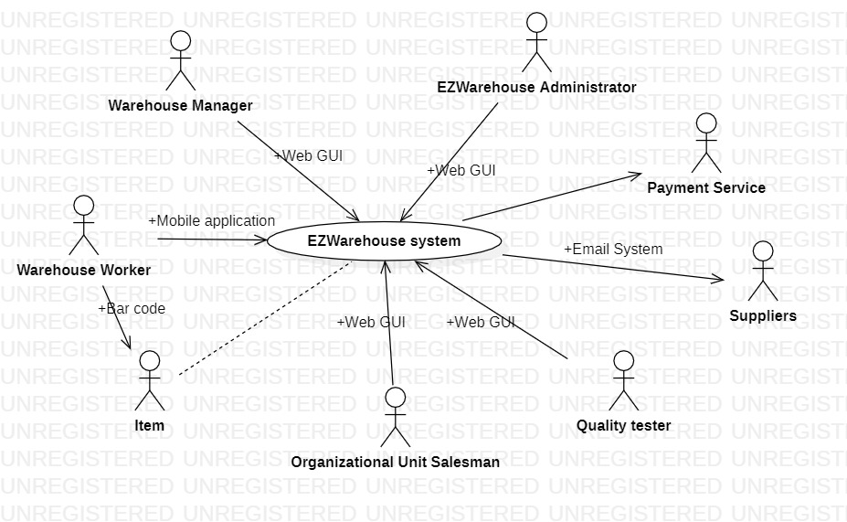
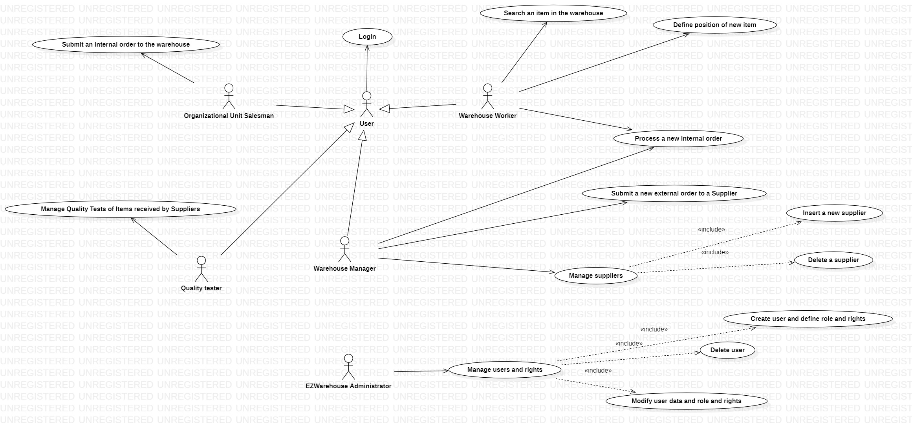
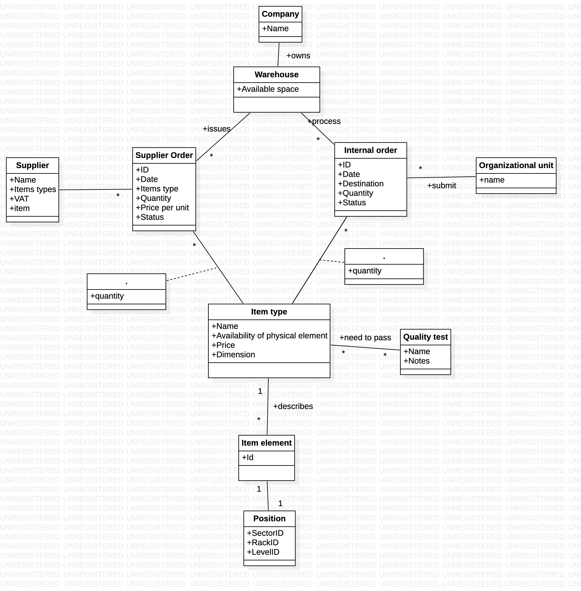
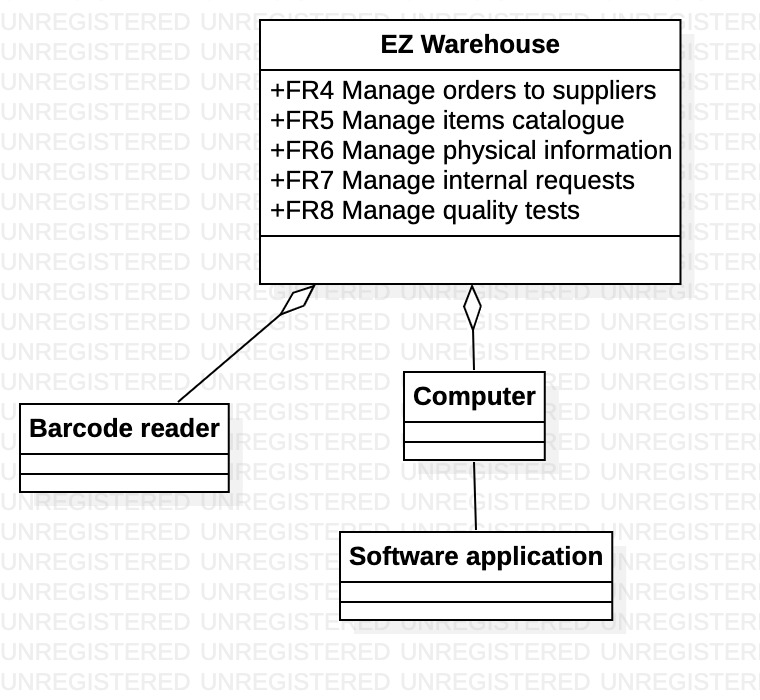
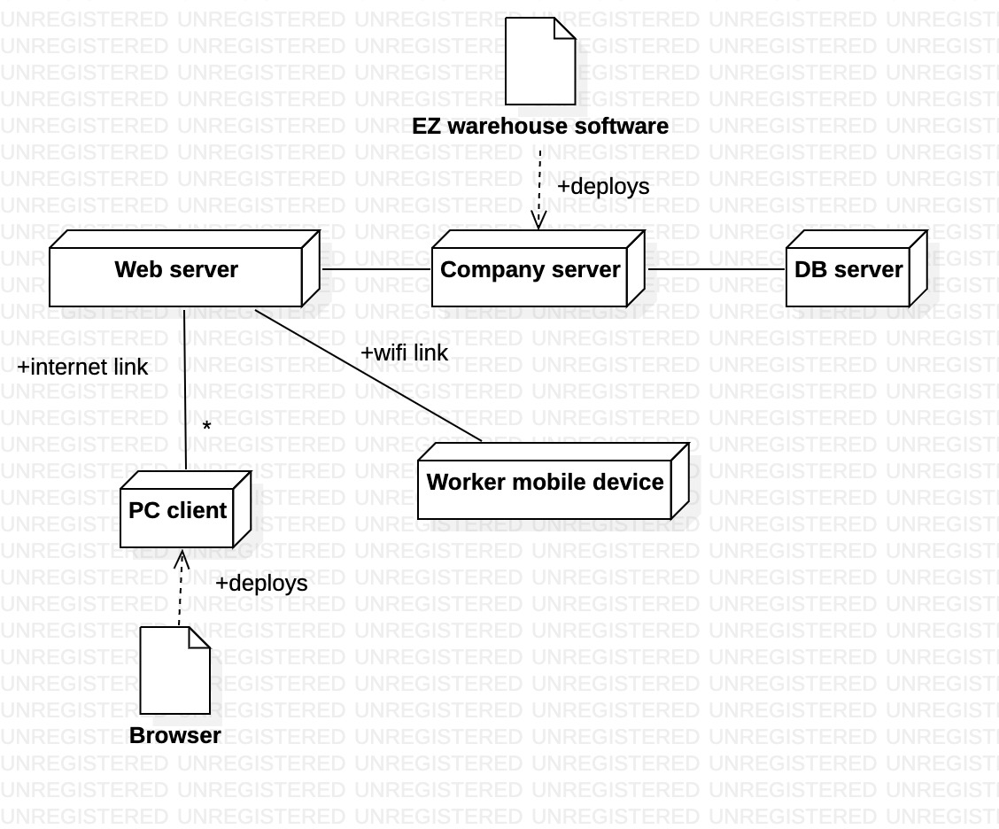

 #Requirements Document 

Date: 22 march 2022

Version: 1.1

 
| Version number | Change |
| ----------------- |:-----------|
| 0.1| added stakeholders, context diagram and interfaces| 
| 0.2| added stories and personas, functional requirement | 
| 0.3| updated functional requirement, added non functional requirement| 
| 0.4| added use case diagram and use cases| 
| 0.5| revised use cases and added scenarios| 
| 0.6| updated scenarios| 
| 0.7| added system design | 
| 0.8| added glossary| 
| 0.9| added deployment diagram| 
| 1.0| review all the document| 
| 1.1| updated previous issues| 

# Contents

- [Informal description](#informal-description)
- [Stakeholders](#stakeholders)
- [Context Diagram and interfaces](#context-diagram-and-interfaces)
	+ [Context Diagram](#context-diagram)
	+ [Interfaces](#interfaces) 
	
- [Stories and personas](#stories-and-personas)
- [Functional and non functional requirements](#functional-and-non-functional-requirements)
	+ [Functional Requirements](#functional-requirements)
	+ [Non functional requirements](#non-functional-requirements)
- [Use case diagram and use cases](#use-case-diagram-and-use-cases)
	+ [Use case diagram](#use-case-diagram)
	+ [Use cases](#use-case-diagram)
- [Glossary](#glossary)
- [System design](#system-design)
- [Deployment diagram](#deployment-diagram)

# Informal description
Medium companies and retailers need a simple application to manage the relationship with suppliers and the inventory of physical items stocked in a physical warehouse. 
The warehouse is supervised by a manager, who supervises the availability of items. When a certain item is in short supply, the manager issues an order to a supplier. In general the same item can be purchased by many suppliers. The warehouse keeps a list of possible suppliers per item. 

After some time the items ordered to a supplier are received. The items must be quality checked and stored in specific positions in the warehouse. The quality check is performed by specific roles (quality office), who apply specific tests for item (different items are tested differently). Possibly the tests are not made at all, or made randomly on some of the items received. If an item does not pass a quality test it may be rejected and sent back to the supplier. 

Storage of items in the warehouse must take into account the availability of physical space in the warehouse. Further the position of items must be traced to guide later recollection of them.

The warehouse is part of a company. Other organizational units (OU) of the company may ask for items in the warehouse. This is implemented via internal orders, received by the warehouse. Upon reception of an internal order the warehouse must collect the requested item(s), prepare them and deliver them to a pick up area. When the item is collected by the other OU the internal order is completed. 

EZWH (EaSy WareHouse) is a software application to support the management of a warehouse.

# Stakeholders

| Stakeholder name  | Description | 
| ----------------- |:-----------:|
| EZWarehouse administrator | Manages the software and is external to the company |
| Warehouse manager | Manages the warehouse, he manages availability of items and keeps a list of possible suppliers per item. Keeps trace of physical position of items in the warehouse and the available space. | 
| Warehouse Worker | Person who physically moves the items in the warehouse and loads them on the system providing info about the location in the warehouse |
| Suppliers | Companies that supply items to the warehouse |
| Quality tester | Worker that performs quality control on items |
| Organizational Unit Salesman | Salesmen belonging to different areas of company that can perform orders to the warehouse |
| Competitors | Other companies that offer the same service |
| Delivery Service | Company department that handles deliveries | 
| Company Intranet | Company network that allows communication between departments |
| Web Hosting | Hosting service for the web application |
| Payment service | Manages payments to the suppliers |

# Context Diagram and interfaces

## Context Diagram

## Interfaces

| Actor | Logical Interface | Physical Interface  |
| ------------- |:-------------:| -----:|
| EZWarehouse Administrator  | Web GUI (Administration and Configuration Panel) | Screen, Keyboard, Mouse |
| Warehouse Manager | Web GUI (Warehouse administration and overview) | Screen, Keyboard, Mouse |
| Warehouse Worker | Mobile application | Mobile device, Bar code reader |
| Suppliers | Email System | Screen, Keyboard, Mouse |
| Quality tester | Web GUI | Screen, Keyboard, Mouse, Bar code reader| 
| Organizational Unit Salesman | Web GUI | Screen, Keyboard, Mouse| 
| Item | Bar code | Laser Beam |
| Payment service |	Bank system | Screen, Keyboard, Mouse|

# Stories and personas

|	Actor	|Story|
| :-: | :-: |
|Warehouse Manager| Michael is 42 and work as a manager for a medium company. He is bordened of work and every day he has to face different problems. Because of his huge responsibilities he sometimes can't sleep at night. But after his company started using the EZWH software Michael had time back for himself.	|
|Warehouse Worker |	Darryl is 40 years old and works as the move-that-heavy-box-over-there guy at a warehouse. He hates this job. His back aches more and more each day and it pays little to nothing, but he has to put food on the table for his two kids and that's the only thing that keeps him going. Recently his boss, Michael, introduced some sort of software to manage the warehouse, which is nice. Now Darryl bippity-boppities his boxes with that laser-pistol-smartphone thingy and the system automatically keeps track of them. He's happier now as he doesn't need to report and see Michael's face that often, and if he screws something up, he can always blame it on the software.|
|Supplier | Dwight is 43 years old and is a salesman at Dunder Mifflin Inc., a paper and packaging supply company. He is a hard worker but he could do much more if only the sales process wasn't so slow and time consuming. He wastes hours and hours on the phone to agree on orders with his customers and for any changes he is forced to call customers again to communicate the changes. But since his customers started using the EZWH software, he conveniently receives supply orders by email and with just one click sends the order directly to the warehouse.  |
|Quality Tester| Creed is 48 and works in the quality office of a warehouse. He loves this work and he is really involved in this. He is responsible in verifying that items received by the warehouse achieve strict quality parameter. Creed is really accurate and careful in this job and spends almost all of his attention to check each single item with different instruments. For this reason he is not interested in waste a lot of time in directly update on the pc specific test failures and acceptance of each item. When he has the result of quality tests, he wants to quickly report these in order to make warehouse workers able to physically manage items just checked.	|
|Organizational Unit Salesman| Jim is a 30 years old salesman in the company's organizational unit. He sells items to customers and then orders them in the company's warehouse so they can be sent over to the customers. He always thought of it as a temporary job, that he would find something more enjoyable and profitable later but, as months grew years, he found himself sitting in the same desk every day, drowning in boredom. Everything is so stale in his workplace, however, recently they introduced a new software, EZWH software, which allows Jim to manage most of the things through the browser, instead of making tons of phonecalls that take way more time. Now he has more time to prank other coworkers and hit on that cute new secretary. |

# Functional and non functional requirements

## Functional Requirements

| ID        | Description  |
| ------------- |:-------------:| 
|  FR1     |  Manage users|
| FR1.1    | Define a new user, or modify an existing user |
| FR1.2     | Delete a user |
|FR1.3     |    List all users   |
|FR1.4    |    Search a user   |
|  FR2     |  Manage roles. Authorize access to functions to specific actors according to their roles |
|	FR3 	| User Login |
| FR3.1	|	Password Recovery |
|  FR4     | Manage orders to suppliers  |
 |  FR4.1     | List all suppliers  |
 |  FR4.2     | Submit a new payment to a supplier|
 |  FR4.3     | List previous payment |
 | 	FR4.4	  | Insert a new supplier |
 |  FR4.5     | Delete a supplier|
 |  FR4.6     | Change supplier information|
 |  FR4.7     | Create a new order |
 |  FR4.8     | List all orders|
 |  FR4.9     | List all orders to a specific supplier |
 |  FR4.10    | List pending orders |
|  FR5    | Manage items catalogue |
 |  FR5.1   | Define new item |
 |  FR5.2   | Remove item |
 |  FR5.3    | Show item details  |
 |	FR5.4	|	Edit item details |
|  FR6  | Manage physical items information  |
|	FR6.1  | Load new items into warehouse |
 |  FR6.2  | Show item position in the warehouse  |
 |  FR6.3  | Show item available quantity |
 |  FR6.4  | Report damaged items |
 |  FR6.5  | Update actual items position |
 |  FR6.6    | Show availability of physical space in the warehouse |
|  FR7     | Manage internal order requests  |
 |  FR7.1   | Submit new internal order |
 | 	FR7.2	| Process internal order |
 |	FR7.3	| Create shipping label for new order and submit to delivery service |
 |  FR7.4   | List pending internal order  |
 |  FR7.5   | List all internal orders  |
 |  FR7.6   | List all orders of a specific item |
 |  FR7.7   | Edit shipping information of an order|
|  FR8   | Manage quality tests  |
 |  FR8.1     | Add new specific quality tests  |
 |  FR8.2     | Insert quality tests result  |
 |  FR8.3     | Select items to be tested after order creation  |
 |  FR8.4     | List tests needed for each item |
 |  FR8.5     | Show quality tests result |

### Access right, actor vs function

| Function | EZWarehouse Administrator | Warehouse manager | Quality tester | Worker | Organizational unit salesman |
| ------------- |:-------------|--|--|--|--|
| FR1| Yes |No |No |No |No |
| FR2| Yes |No |No |No |No |
| FR3| Yes |Yes |Yes |Yes |Yes |
| FR4| No |Yes |No |No |No |
| FR6.1| No |Yes |No |Yes |No |
| FR6.2| No |Yes |No |Yes |No |
| FR6.3| No |Yes |No |No |No |
| FR6.4| No |No |No |Yes |No |
| FR6.5| No |No |No |Yes |No |
| FR6.6| No |Yes |No |No |No |
| FR7.1| No |No |No |No |Yes |
| FR7.2| No |Yes |No |No |No |
| FR7.3| No |Yes |No |Yes |No |
| FR7.4| No |Yes |No |No |No |
| FR7.5| No |Yes |No |No |No |
| FR7.6| No |Yes |No |No |No |
| FR7.7| No |Yes |No |No |No |
| FR8.1| No |Yes |No |No |No |
| FR8.2| No |No |Yes |No |No |
| FR8.3| No |Yes |No |No |No |
| FR8.4| No |Yes |Yes |No |No |
| FR8.5| No |Yes |No |No |No |

## Non Functional Requirements

| ID        | Type (efficiency, reliability, ..)           | Description  | Refers to |
| ------------- |:-------------:| :-----:| -----:|
|  NFR1     | Usability | Application should be used with no specific training for the users | All FR |
|  NFR2     | Performance | All functions should complete in < 0.5 sec  | All FR |
|  NFR3		| Reliability | Functions that change availability of items should implement mechanisms for multiple access from different users that don't cause warehouse inconsistency | FR5, FR6, FR7 |
|  NFR4     | Portability | The application should be accessed by Chrome (version 81 and more recent), and Safari (version 13 and more recent) (this covers around 80% of installed browsers); and from the operating systems where these browsers are available (Android, IoS, Windows, MacOS, Unix). As for devices, the application should be usable on smartphones (portrait) and PCs (landscape). | All FR |
|  NFR5     | Localisation | Decimal numbers use . (dot) as decimal separator |All FR|
| NFR6 | Reliability | Warehouse Database needs a periodic backup | All FR |

# Use case diagram and use cases

## Use case diagram

##### Scenario 1.1

## Use case 1, UC1 - Manage users and rights

| Actors Involved        | EZWarehouse Administrator |
| ------------- |:-------------:|
|  Precondition | EZWarehouse administrator A logged in |
|  Post condition |  |
|  Nominal Scenario |  A defines a new user and specifies its role and access rights  |
|  Variants     | A modifies fields, role or access rights of an existing user |

### Scenario 1.1

| Scenario |  Create user and define role and rights |
| ------------- |:-------------:| 
|  Precondition     | EZWarehouse administrator A exists and is logged in |
|  Post condition     | User X is created |
| Step#        | Description  |
|  1    |  A defines the credentials of the new User X |  
|  2    |  A selects the role and defines the access rights for the new user X |
|  3    |  A confirms the inserted data |

### Scenario 1.2

| Scenario |  Delete user |
| ------------- |:-------------:| 
|  Precondition     | EZWarehouse administrator A exists and is logged in |
|  | User X exists |
|  Post condition     | User X deleted |
| Step#        | Description  |
|  1    |  A selects user X  |
|  2    |  X deleted from the system |

### Scenario 1.3

| Scenario |  Modify user data, role and rights |
| ------------- |:-------------:| 
|  Precondition     | EZWarehouse administrator A exists and is logged in |
|  | User X exists |
|  Post condition     | X's data, role and rights updated |
| Step#        | Description  |
|  1    |  A selects user X  |
|  2    |  A modifies user's data and selects a new role and new access rights for X |
|  3    |  A confirms the inserted data |

## Use case 2, UC2 - Define position of new item
| Actors involved | Warehouse worker |
| ------------- |:-------------:|
| Precondition | Warehouse worker W has items to store |
| | W is logged into the system | 
| | The warehouse has sufficient storage space | 
| Post condition | The system records item's storage space |
| Nominal scenario | W assigns a storage space to an item |
| Variants | Update position of item in the warehouse | 

### Scenario 2.1
| Scenario | Warehouse worker stores item successfully |
| ------------- |:-------------:|
| Precondition | Warehouse worker W has items to store | 
| | W is logged into the system | 
| | The warehouse has sufficient storage space |
| Post condition | The system records item's storage space |
| Step# | Description |
| 1 | W provides to the system the id of the item being managed |
| 2 | W provides to the system the id of the storage space to be assigned |
| 3 | The system informs W that the item can be stored and that the position has been recorded |
| 4 | W stores the item in the storage space |

### Scenario 2.2
| Scenario | Warehouse worker can't store item |
| ------------- |:-------------:|
| Precondition | Warehouse worker W has items to store |
| | W is logged into the system |  
| | The warehouse has sufficient storage space |
| Post condition | The system records item's storage space |
| Step# | Description |
| 1 | W provides to the system the id of the item being managed |
| 2 | W provides to the system the id of the storage space to be assigned |
| 3 | The system informs W that the item can't be stored in that space |
| 4 | The system informs W why the item can't be stored in that space |

## Use case 3, UC3 - Search an item in the warehouse
| Actors involved | Warehouse worker |
| ------------- |:-------------:|
| Precondition | An item is stored in the warehouse |
| | Warehouse worker W is logged into the system | 
| Post condition | W knows the position of the item | 
| Nominal scenario | W queries the EzWarehouse system with item's identifying data and receives its position in return |

### Scenario 3.1
| Scenario | Warehouse worker finds item in the warehouse |
| ------------- |:-------------:|
| Precondition | The item is stored in the warehouse |
| | W  is logged into the system | 
| Post condition | W knows the exact storage space of an item |
| Step# | Description |
| 1 |  W provides to the system identifying information of an item |
| 2 |  EZWarehouse system serches in the database for the item |
| 3 |  EZWarehouse system provides information about the location of the searched item |

### Scenario 3.2
| Scenario | Warehouse worker doesn't find item in the warehouse |
| ------------- |:-------------:|
| Precondition |  W is logged into the system | 	|
| Post condition | W knows that there's no item in the warehouse that matches the query |
| Step# | Description |
| 1 |  W provides to the system identifying information of an item |
| 2 | The EZWarehouse system searches in the database for the item |
| 3 | The EZWarehouse system doesn't find the item and informs  W that there's no such item in the warehouse. |

## Use case 4, UC4 - Login
| Actors Involved   | User |
| ------------- |:-------------:|
|  Precondition | User X's account exists |
|  Post condition | X has access to his account |
|  Nominal Scenario | X identifies to the system |
|  Variants     | Identification data don't match an existing account |

### Scenario 4.1
|   Scenario    |   Login is performed correctly    |
| ------------- |:-------------:|
|   Precondition | User X account exists |
|   Postcondition | X is logged in |
| Step# | Description |
| 1 | X enters the login interface |
| 2 | X provides the requested identification data |
| 3 | The system checks the provided identification data |
| 4 | X has access to his account |

### Scenario 4.2
| Scenario | Login is performed incorrectly |
| ------------- |:-------------:|
| Precondition | User X doesn't have correct login data |
| Postcondition| X can't access the system |
| Step# | Description |
| 1 | X enters the login interface |
| 2 | X provides the requested login data |
| 3 | The system checks the provided login |
| 4 | The system informs  X that the data provided don't match any existing account |

## Use case 5, UC5 - Process a new internal order
| Actors Involved  | Warehouse manager, Warehouse worker |
| ------------- |:-------------:| 
|  Precondition     | Warehouse has already received the internal order request |
|    | Warehouse manager M is logged in |
|    | Items are available|
|    | Items position is defined |
|    | Items destination is defined |
|  Post condition     | Requested items are packaged and ready to be delivered in the pick up area |
|  Nominal Scenario     | Internal orders are processed verifying items availability and setting up the instruction for workers, in order to submit the delivery |
|  Exceptions  | Items are unavailable |
|      | Delivery service is unavailable or does not satisfy items requests|

### Scenario 5.1 
| Scenario |  Create a shipping label for delivery service |
| ------------- |:-------------:| 
|  Precondition     | Warehouse manager M account exists and is logged in |
|  Precondition     | Warehouse has already received the internal order request |
|    | Items position is defined  |
|    | Items destination is defined  |
|  Post condition     | A shipping label is generated with the information about the destination of the internal order |
| Step#        | Description  |
|  1  |  M enters shipping address of the order |
|  2    |  M confirms the entered data |

### Scenario 5.2  
| Scenario |  Reject the order |
| ------------- |:-------------:| 
|  Precondition     | Warehouse manager M account exists and is logged in |
|      | Warehouse has already received the internal order request |
|  Post condition     | M notifies to the OU salesman that requested items are unavailable|
| Step#        | Description  |
|  1  |  M checks the requests |
|  2  | One or more of the requested items are unavailable
|  3  |  M sends a notification to the salesman about the unavailability of items |

## Use case 6, UC6 - Submit a new external order to a Supplier 
| Actors Involved        | Warehouse Manager, Supplier |
| ------------- |:-------------:| 
|  Precondition  | One or more items in the warehouse are in short supply |
|  Post condition | Order is executed and the warehouse manager pays the supplier S |
|  Nominal Scenario | The Warehouse manager creates a new order request. He compiles the different fields and sends the request to S |
|  Exceptions    | Unavailability of physical space in the warehouse |

### Scenario 6.1
| Scenario 6.1 | Create a new order |
| ------------- |:-------------:| 
|Precondition | Warehouse manager M is logged in | 
| | One or more items in the warehouse are in short supply |
|Postcondition | The supplier receives the order |
|Step#   |Description|
|1    | M selects the items for a new order request |
|2    | M selects one of the possible supplier from the list |
|3	  | Supplier receives the order and accepts it	 
|4 	  | M processes the payment of the order
|5    | Status of the order changes to "Processing" ?

## Use case 7, UC7 -  Manage suppliers
| Actors Involved | Warehouse manager |
| ------------- |:-------------:| 
|  Precondition  | Warehouse manager M is logged in |
|  Post condition | The list of suppliers is updated |
|  Nominal Scenario | M inserts a new supplier (if not existing) in the software system. M also inserts some specific information about the supplier |
|  Variants     | M deletes supplier X from the list of suppliers|
|        | M edits some information about supplier X|

### Scenario 7.1
| Scenario 7.1 |Insert a new supplier |
| ------------- |:-------------:| 
|Precondition | Supplier S is not on the list of suppliers | 
|  | Warehouse manager is logged in |
|Postcondition |  S is added to the list of suppliers|
|Step#   |Description|
|1    | A supplier is chosen by the manager and added to the list of suppliers, along with additional information |
|2    | The changes are saved by the software |

### Scenario 7.2
| Scenario 7.2 | Delete a supplier |
| ------------- |:-------------:| 
|Precondition | Supplier S is on the list of suppliers | 
|  | Warehouse manager M is logged in |
|Postcondition | Supplier S is removed from the list of suppliers |
|Step#   |Description|
|1	    | M selects the supplier that he wants to delete |
|2    | The software checks that there are no incoming deliveries from that supplier |
|3    | The changes are saved by the software |

## Use case 8, UC8 - Manage Quality Tests of Items received by Suppliers

| Actors Involved        | Quality Tester, Supplier |
| ------------- |:-------------:|
|  Precondition | Quality Tester Q is logged in |
| | Item I belongs to a received order by Supplier S |
|  Post condition |  |
|  Nominal Scenario |  Q performs a quality test on I and sends it to the warehouse  |
|  Variants     | The quality test is negative and I is rejected and sent back to S |

### Scenario 8.1

| Scenario |  Quality Test is positive and the Item is accepted |
| -------------- |:-------------:| 
|  Precondition     | Quality Tester Q is logged in |
| | Item I belongs to a received order by Supplier S |
|  Post condition     | Item I is stocked in the warehouse
| Step#        | Description  |
|  1    |  Q randomly (or following a specified algorithm) selects one or more items I among the items received in the order by S |
|  2    |  Q performs the quality tests associated to the item I |
|  3    |  Q reports tests results |
|  4    |  All tests are passed so I is sent to the warehouse |

### Scenario 8.2

| Scenario |  Quality Test is negative and the Item is rejected |
| -------------- |:-------------:| 
|  Precondition     | Quality Tester Q is logged in |
| | Item X belongs to a received order by Supplier S |
|  Post condition     | Item I is returned to the S
| Step#        | Description  |
|  1    |  Q randomly (or following a specified algorithm) selects one or more items I among the items received in the order by S |
|  2    |  Q performs the quality tests associated to the item I |
|  3    |  Q reports tests results |
|  4    |  One or more tests are negative |
| 5		| I is sent back to S with the test result containing the reason of the failure |

## Use case 9, UC9 - Submit an internal order to the warehouse
| Actors Involved  | Organizational unit salesman, Warehouse manager |
| ------------- |:-------------:| 
|  Precondition     | Salesman SM account already exists and is logged in |
|  Post condition     | Internal order is sent to the Warehouse manager |
|  Nominal Scenario     | Internal orders are created by SM of an organizational unit of the company. He defines items needed and specify the delivery information |
|  Variants     | Order has already been created, SM needs to change delivery information |
|  Exceptions  | Requested items are not available |
|    | Warehouse manager rejects the order|

# Glossary

# System Design

# Deployment Diagram 

