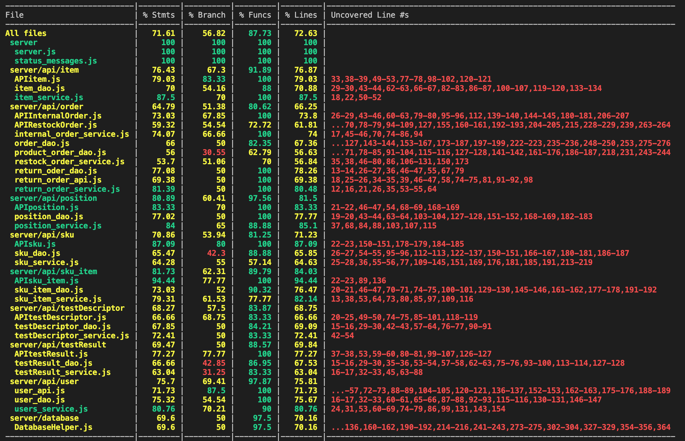

# Unit Testing Report

Date: 21/06/2022

Version: 1.5

# Contents

- [Black Box Unit Tests](#black-box-unit-tests)

- [White Box Unit Tests](#white-box-unit-tests)

# Black Box Unit Tests

    <Define here criteria, predicates and the combination of predicates for each function of each class.
    Define test cases to cover all equivalence classes and boundary conditions.
    In the table, report the description of the black box test case and (traceability) the correspondence with the Jest test case writing the
    class and method name that contains the test case>
    <Jest tests  must be in code/server/unit_test  >

### **Class _UsersService_ - method _getUsersByType_**

**Criteria for method getUsersByType :**

- Users with specific type are obtained correctly.

**Predicates for method getUsersByType :**

| Criteria                            | Predicate |
| ----------------------------------- | --------- |
| List of users is returned correctly | Valid     |
|                                     | Invalid   |

**Combination of predicates**:

| List of users is returned correctly | Valid / Invalid | Description of the test case  | Jest test case  |
| ----------------------------------- | --------------- | --------------------------|---------------------------------------------- | 
|  *  | Valid  | let res = await user_service.getUsersByType(type) | user_service.test.js -> method testUsersByType() |      

### **Class _UsersService_ - method _getAllUsers_**

**Criteria for method getAllUsers :**

- All Users in the database are returned correctly.

**Predicates for method getAllUsers :**

| Criteria                                | Predicate |
| --------------------------------------- | --------- |
| List of all users is returned correctly | Valid     |
|                                         | Invalid   |

**Combination of predicates**:

| List of all users is returned correctly | Valid / Invalid | Description of the test case      | Jest test case        |
| --------------------------------------- | --------------- | ------------------------------------------ | --- | 
|  | Valid    | let res = await user_service.getAllUsers() | user_service.test.js -> method testGetAllUsers() |     

### **Class _UsersService_ - method _getSuppliers_**

**Criteria for method getSuppliers :**

- Users of type supplier are obtained correctly.

**Predicates for method getSuppliers :**

| Criteria                                | Predicate |
| --------------------------------------- | --------- |
| List of suppliers is returned correctly | Valid     |
|                                         | Invalid   |

**Combination of predicates**:

| List of suppliers is returned correctly | Valid / Invalid | Description of the test case                | Jest test case       |
| --------------------------------------- | --------------- | ------------------------------------------- | --- |
|   | Valid      | let res = await user_service.getSuppliers() | user_service.test.js -> method testGetSuppliers() |     

### **Class _UsersService_ - method _updateType_**

**Criteria for method updateType :**

- The type of the specified user is updated correctly.

**Predicates for method updateType :**

| Criteria                              | Predicate |
| ------------------------------------- | --------- |
| The type of specified user is updated | Valid     |
|                                       | Invalid   |

**Combination of predicates**:

| List of users is returned correctly | Valid / Invalid | Description of the test case       | Jest test case    |
| ----------------------------------- | --------------- | ------------------------------------------------------ | ------------------ | 
|       | Valid           | await user_service.updateType(email, oldType, newType) | user_service.test.js -> method testUpdateType() |    

### **Class _UsersService_ - method _deleteUser_**

**Criteria for method updateType :**

- Specified user is removed from database.

**Predicates for method deleteUser :**

| Criteria        | Predicate |
| --------------- | --------- |
| User is deleted | Valid     |
|                 | Invalid   |

**Combination of predicates**:

| User is deleted | Valid / Invalid | Description of the test case        | Jest test case        |
| --------------- | --------------- | ------------------------------------------ | -----------------------------------------------|
| | Valid           | await user_service.deleteUser(email, type) | user_service.test.js -> method testDeleteUser() |     

### **Class _ReturnOrderService_ - method _newReturnOrder_**

**Criteria for method newReturnOrder :**

- A new return order is correctly creaded and saved in database.

**Predicates for method newReturnOrder :**

| Criteria                                      | Predicate |
| --------------------------------------------- | --------- |
| Return order is creaded and saved in database | Valid     |
|                                               | Invalid   |

**Combination of predicates**:

| Return order is creaded and saved in database | Valid / Invalid | Description of the test case     | Jest test case        |
| --------------------------------------------- | --------------- | -------------------------------- | --------------|
| | Valid           | let res = await return_order_service.newReturnOrder(returnDate, products, restockOrderId) | return_order_service.test.js -> method testNewReturnOrder() |     

### **Class _ReturnOrderService_ - method _getReturnOrders_**

**Criteria for method getReturnOrders :**

- All return orders in database are returned correctly

**Predicates for method getReturnOrders :**

| Criteria                                             | Predicate |
| ---------------------------------------------------- | --------- |
| All return orders in database are returned correctly | Valid     |
|                                                      | Invalid   |

**Combination of predicates**:

| All return orders in database are returned correctly | Valid / Invalid | Description of the test case   | Jest test case     |
| ------------------------------------- | --------------- | ------------------------------------------------------ | ------- | 
|     | Valid    | let res = await return_order_service.getReturnOrders() | return_order_service.test.js -> method testNewReturnOrder() |     

### **Class _ReturnOrderService_ - method _getReturnOrderById_**

**Criteria for method getReturnOrderById :**

- Specified return order is returned from database.

**Predicates for method getReturnOrderById :**

| Criteria                           | Predicate |
| ---------------------------------- | --------- |
| Specified return order is received | Valid     |
|                                    | Invalid   |

**Combination of predicates**:

| Specified return order is received | Valid / Invalid | Description of the test case      | Jest test case     |
|--------- | --------------- | --------------------------------------- | ------------------------------------------------------------ | 
|      | Valid           | let res = await return_order_service.getReturnOrderById(id) | return_order_service.test.js -> method testReturnOrderById() | 

### **Class _ReturnOrderService_ - method _deleteReturnOrder_**

**Criteria for method deleteReturnOrder :**

- Specified return order is deleted from database.

**Predicates for method deleteReturnOrder :**

| Criteria                          | Predicate |
| --------------------------------- | --------- |
| Specified return order is deleted | Valid     |
|                                   | Invalid   |

**Combination of predicates**:

| Specified return order is deleted | Valid / Invalid | Description of the test case  | Jest test case     |
| --------------------------------- | --------------- | ----------------------------- | --- | 
|     | Valid           | let res = await return_order_service.deleteReturnOrder(id) | return_order_service.test.js -> method testDeleteReturnOrder() |    

### **Class _sku_dao_ - method _getAllSku_**

**Criteria for method getAllSku :**

- Database is reachable

**Predicates for method getAllSku :**

| Criteria              | Predicate |
| --------------------- | --------- |
| Database is reachable | True      |
|                       | False     |

**Combination of predicates**:

| Criteria 1 | Valid / Invalid |     Description of the test case     |              Jest test case               |
| :--------: | :-------------: | :----------------------------------: | :---------------------------------------: |
|    True    |      Valid      | sku_dao.getAllSku(); -> returns skus | sku_dao.test.js -> method testGetAllSku() |
|   False    |     Invalid     |                  "                   |                     "                     |

### **Class _sku_dao_ - method _getSkuById_**

**Criteria for method getSkuById :**

- Database is reachable
- Sku with given sku_id exists

**Predicates for method getSkuById:**

| Criteria              | Predicate |
| --------------------- | --------- |
| Database is reachable | True      |
|                       | False     |
| SkuId exists          | True      |
|                       | False     |

**Combination of predicates**:

| Criteria 1 | Criteria 2 | Valid / Invalid |        Description of the test case         |               Jest test case               |
| :--------: | :--------: | :-------------: | :-----------------------------------------: | :----------------------------------------: |
|     \*     |    True    |      Valid      | sku_dao.getSkuById(new_sku); -> returns sku | sku_dao.test.js -> method testGetSkuById() |
|     \*     |   False    |     Invalid     |                      "                      |                     "                      |

### **Class _sku_dao_ - method _newSKU_**

**Criteria for method newSKU :**

- Database is reachable
- description, weight, volume ,notes, price and availableQuantity are not null and in a good format

**Predicates for method newSKU:**

| Criteria                             | Predicate |
| ------------------------------------ | --------- |
| Database is reachable                | True      |
|                                      | False     |
| Parameters are in the correct format | True      |
|                                      | False     |

**Combination of predicates**:

| Criteria 1 | Criteria 2 | Valid / Invalid |                                  Description of the test case                                  |             Jest test case             |
| :--------: | :--------: | :-------------: | :--------------------------------------------------------------------------------------------: | :------------------------------------: |
|     \*     |    True    |      Valid      | sku_dao.newSKU(description,weight,volume,notes,price,availableQuantity); -> returns new sku id | sku_dao.test.js -> method testNewSku() |
|     \*     |   False    |     Invalid     |                                               "                                                |                   "                    |

### **Class _sku_dao_ - method _updateSKU_**

**Criteria for method updateSKU :**

- Database is reachable
- newDescription, newWeight, newVolume ,newNotes, newPrice and newAvailableQuantity are not null and in a good format

**Predicates for method updateSKU:**

| Criteria                             | Predicate |
| ------------------------------------ | --------- |
| Database is reachable                | True      |
|                                      | False     |
| Parameters are in the correct format | True      |
|                                      | False     |

**Combination of predicates**:

| Criteria 1 | Criteria 2 | Valid / Invalid |                                 Description of the test case                                 |              Jest test case               |
| :--------: | :--------: | :-------------: | :------------------------------------------------------------------------------------------: | :---------------------------------------: |
|     \*     |    True    |      Valid      | sku_dao.updateSKU(newDescription, newWeight, newVolume ,newNotes, newPrice) -> returns 200 ; | sku_dao.test.js -> method testUpdateSku() |
|     \*     |   False    |     Invalid     |                                              "                                               |                     "                     |

### **Class _sku_dao_ - method _updatePositionData_**

**Criteria for method updatePositionData :**

- Database is reachable
- positionId, newAvailableQuantity, newWeight, newVolume, oldAvailableQuantity, oldWeight, oldVolume, oldPositionValues are not null and in a good format
- newWeight, newVolume and newAvailableQuantity satisfy the costraints of maxWeight and maxVolume of position associated to positionId

**Predicates for method updatePositionData:**

| Criteria                                                         | Predicate |
| ---------------------------------------------------------------- | --------- |
| Database is reachable                                            | True      |
|                                                                  | False     |
| Parameters are in the correct format                             | True      |
|                                                                  | False     |
| newWeight, newVolume and newAvailableQuantity satisfy costraints | True      |
|                                                                  | False     |

**Combination of predicates**:

| Criteria 1 | Criteria 2 | Criteria 3 | Valid / Invalid |                                                                   Description of the test case                                                                    |                   Jest test case                   |
| :--------: | :--------: | :--------: | :-------------: | :---------------------------------------------------------------------------------------------------------------------------------------------------------------: | :------------------------------------------------: |
|     \*     |    True    |    True    |      Valid      | sku_dao.updatePositionData(positionId, newAvailableQuantity, newWeight, newVolume, oldAvailableQuantity, oldWeight, oldVolume, oldPositionValues); -> returns 200 | sku_dao.test.js -> method testUpdatePositionData() |
|     \*     |    True    |   False    |     Invalid     |                                                                            returns 422                                                                            |                         "                          |
|     \*     |   False    |    True    |     Invalid     |                                                                            returns 422                                                                            |                         "                          |
|     \*     |   False    |   False    |     Invalid     |                                                                            returns 422                                                                            |                         "                          |

### **Class _sku_dao_ - method _deleteSku_**

**Criteria for method deleteSku :**

- Database is reachable
- Sku with given sku_id exists

**Predicates for method deleteSku:**

| Criteria                     | Predicate |
| ---------------------------- | --------- |
| Database is reachable        | True      |
|                              | False     |
| Sku with given sku_id exists | True      |
|                              | False     |

**Combination of predicates**:

| Criteria 1 | Criteria 2 | Valid / Invalid |       Description of the test case       |              Jest test case               |
| :--------: | :--------: | :-------------: | :--------------------------------------: | :---------------------------------------: |
|     \*     |    True    |      Valid      | sku_dao.deleteSku(skuID); -> returns 204 | sku_dao.test.js -> method testDeleteSku() |
|     \*     |   False    |     Invalid     |                    "                     |                     "                     |

### **Class _sku_item_dao_ - method _getAllSkuItems_**

**Criteria for method getAllSkuItems :**

- Database is reachable

**Predicates for method getAllSkuItems :**

| Criteria              | Predicate |
| --------------------- | --------- |
| Database is reachable | True      |
|                       | False     |

**Combination of predicates**:

| Criteria 1 | Valid / Invalid |            Description of the test case             |                   Jest test case                    |
| :--------: | :-------------: | :-------------------------------------------------: | :-------------------------------------------------: |
|     \*     |      Valid      | sku_item_dao.getAllSkuItems(); -> returns sku_items | sku_item_dao.test.js -> method testGetAllSkuItems() |

### **Class _sku_item_dao_ - method _getSkuItemsBySkuId_**

**Criteria for method getSkuItemsBySkuId :**

- Database is reachable
- Sku with given sku_id exists

**Predicates for method getSkuItemsBySkuId :**

| Criteria                     | Predicate |
| ---------------------------- | --------- |
| Database is reachable        | True      |
|                              | False     |
| Sku with given sku_id exists | True      |
|                              | False     |

**Combination of predicates**:

| Criteria 1 | Criteria 2 | Valid / Invalid |                 Description of the test case                 |                     Jest test case                      |
| :--------: | :--------: | :-------------: | :----------------------------------------------------------: | :-----------------------------------------------------: |
|     \*     |    True    |      Valid      | sku_item_dao.getSkuItemsBySkuId(skuID); -> returns sku_items | sku_item_dao.test.js -> method testGetSkuItemsBySkuId() |
|     \*     |   False    |     Invalid     |                              "                               |                            "                            |

### **Class _sku_item_dao_ - method _getSkuItemByRFID_**

**Criteria for method getSkuItemByRFID :**

- Database is reachable
- Sku Item with given rfid exists

**Predicates for method getSkuItemByRFID :**

| Criteria                        | Predicate |
| ------------------------------- | --------- |
| Database is reachable           | True      |
|                                 | False     |
| Sku Item with given rfid exists | True      |
|                                 | False     |

**Combination of predicates**:

| Criteria 1 | Criteria 2 | Valid / Invalid |               Description of the test case               |                    Jest test case                     |
| :--------: | :--------: | :-------------: | :------------------------------------------------------: | :---------------------------------------------------: |
|     \*     |    True    |      Valid      | sku_item_dao.getSkuItemByRFID(rfid); -> returns sku_item | sku_item_dao.test.js -> method testGetSkuItemByRFID() |
|     \*     |   False    |     Invalid     |                            "                             |                           "                           |

### **Class _sku_item_dao_ - method _newSkuItem_**

**Criteria for method newSkuItem :**

- Database is reachable
- RFID, SKUId and DateOfStock are defined and valid
- Sku with given SKUId exists

**Predicates for method newSkuItem :**

| Criteria                                          | Predicate |
| ------------------------------------------------- | --------- |
| Database is reachable                             | True      |
|                                                   | False     |
| RFID, SKUId and DateOfStock are defined and valid | True      |
|                                                   | False     |
| Sku with given SKUId exists                       | True      |
|                                                   | False     |

**Combination of predicates**:

| Criteria 1 | Criteria 2 | Criteria 3 | Valid / Invalid |                         Description of the test case                          |                 Jest test case                  |
| :--------: | :--------: | :--------: | :-------------: | :---------------------------------------------------------------------------: | :---------------------------------------------: |
|     \*     |    True    |    True    |      Valid      | sku_item_dao.newSkuItem(RFID, SKUId, DateOfStock); -> returns new sku_item id | sku_item_dao.test.js -> method testNewSkuItem() |
|     \*     |    True    |   False    |     Invalid     |                                       "                                       |                        "                        |
|     \*     |   False    |    True    |     Invalid     |                                       "                                       |                        "                        |
|     \*     |   False    |   False    |     Invalid     |                                       "                                       |                        "                        |

### **Class _sku_item_dao_ - method _updateSkuItem_**

**Criteria for method updateSkuItem :**

- Database is reachable
- newRFID, newAvailable and newDateOfStock are defined and valid
- Sku Item with given rfid exists

**Predicates for method updateSkuItem :**

| Criteria                                                       | Predicate |
| -------------------------------------------------------------- | --------- |
| Database is reachable                                          | True      |
|                                                                | False     |
| newRFID, newAvailable and newDateOfStock are defined and valid | True      |
|                                                                | False     |
| Sku Item with given rfid exists                                | True      |
|                                                                | False     |

**Combination of predicates**:

| Criteria 1 | Criteria 2 | Criteria 3 | Valid / Invalid |                                    Description of the test case                                     |                   Jest test case                   |
| :--------: | :--------: | :--------: | :-------------: | :-------------------------------------------------------------------------------------------------: | :------------------------------------------------: |
|     \*     |    True    |    True    |      Valid      | sku_item_dao.updateSkuItem(rfid, newRFID, newAvailable, newDateOfStock); -> returns new sku_item id | sku_item_dao.test.js -> method testUpdateSkuItem() |
|     \*     |    True    |   False    |     Invalid     |                                                  "                                                  |                         "                          |
|     \*     |   False    |    True    |     Invalid     |                                                  "                                                  |                         "                          |
|     \*     |   False    |   False    |     Invalid     |                                                  "                                                  |                         "                          |

### **Class _sku_item_dao_ - method _updateOrderIdSkuItem_**

**Criteria for method updateOrderIdSkuItem :**

- Database is reachable
- Order with given id exists
- Sku Item with given rfid exists

**Predicates for method updateOrderIdSkuItem :**

| Criteria                        | Predicate |
| ------------------------------- | --------- |
| Database is reachable           | True      |
|                                 | False     |
| Order with given id exists      | True      |
|                                 | False     |
| Sku Item with given rfid exists | True      |
|                                 | False     |

**Combination of predicates**:

| Criteria 1 | Criteria 2 | Criteria 3 | Valid / Invalid |                                  Description of the test case                                  |                      Jest test case                       |
| :--------: | :--------: | :--------: | :-------------: | :--------------------------------------------------------------------------------------------: | :-------------------------------------------------------: |
|     \*     |    True    |    True    |      Valid      | sku_item_dao.updateOrderIdSkuItem(rfid, newRFID, newAvailable, newDateOfStock); -> returns 200 | sku_item_dao.test.js -> method testUpdateOrderIdSkuItem() |
|     \*     |    True    |   False    |     Invalid     |                                               "                                                |                             "                             |
|     \*     |   False    |    True    |     Invalid     |                                               "                                                |                             "                             |
|     \*     |   False    |   False    |     Invalid     |                                               "                                                |                             "                             |

### **Class _sku_item_dao_ - method _deleteSkuItem_**

**Criteria for method deleteSkuItem :**

- Database is reachable
- Sku Item with given rfid exists

**Predicates for method deleteSkuItem :**

| Criteria                        | Predicate |
| ------------------------------- | --------- |
| Database is reachable           | True      |
|                                 | False     |
| Sku Item with given rfid exists | True      |
|                                 | False     |

**Combination of predicates**:

| Criteria 1 | Criteria 2 | Valid / Invalid |           Description of the test case           |                   Jest test case                   |
| :--------: | :--------: | :-------------: | :----------------------------------------------: | :------------------------------------------------: |
|     \*     |    True    |      Valid      | sku_item_dao.deleteSkuItem(rfid); -> returns 204 | sku_item_dao.test.js -> method testDeleteSkuItem() |
|     \*     |   False    |     Invalid     |                        "                         |                         "                          |

### **Class _position_dao_ - method _getAllPosition_**

**Criteria for method getAllPosition :**

- Database is reachable
**Predicates for method getAllPosition :**

| Criteria                        | Predicate |
| ------------------------------- | --------- |
| Database is reachable           | True      |
|                                 | False     |

**Combination of predicates**:

| Criteria 1 | Valid / Invalid |           Description of the test case           |                   Jest test case                   |
| :--------: | :-------------: | :----------------------------------------------: | :------------------------------------------------: |
|     \*     |      Valid      | position_dao.getAllPosition(); -> returns positions | position_dao.test.js -> method testGetAllPosition() |
|     \*     | |     Invalid     |                        "                         |                         "                          |

### **Class _position_dao_ - method _newPosition_**

**Criteria for method newPosition :**

- Database is reachable
**Predicates for method newPosition :**

| Criteria                        | Predicate |
| ------------------------------- | --------- |
| Database is reachable           | True      |
|                                 | False     |

**Combination of predicates**:

| Criteria 1 | Valid / Invalid |           Description of the test case           |                   Jest test case                   |
| :--------: | :-------------: | :----------------------------------------------: | :------------------------------------------------: |
|     \*     |      Valid      | position_dao.newPosition(positionID, aisleID, row, col, maxWeight, maxVolume); -> returns new position id | position_dao.test.js -> method testnewPosition(positionID, aisleID, row, col, maxWeight, maxVolume) |
|     \*     | |     Invalid     |                        "                         |                         "                          |

### **Class _position_dao_ - method _updatePosition_**

**Criteria for method updatePosition :**

- Database is reachable
**Predicates for method updatePosition :**

| Criteria                        | Predicate |
| ------------------------------- | --------- |
| Database is reachable           | True      |
|                                 | False     |

**Combination of predicates**:

| Criteria 1 | Valid / Invalid |           Description of the test case           |                   Jest test case                   |
| :--------: | :-------------: | :----------------------------------------------: | :------------------------------------------------: |
|     \*     |      Valid      | position_dao.updatePosition(positionID, newAisleID, newRow, newCol, newMaxWeight, newMaxVolume, newOccupiedWeight, newOccupiedVolume); -> returns updated position id | position_dao.test.js -> method testUpdatePosition(positionID, newAisleID, newRow, newCol, newMaxWeight, newMaxVolume, newOccupiedWeight, newOccupiedVolume) |
|     \*     | |     Invalid     |                        "                         |                         "                          |

### **Class _position_dao_ - method _updatePositionOccupation_**

**Criteria for method updatePositionOccupation :**

- Database is reachable
**Predicates for method updatePositionOccupation :**

| Criteria                        | Predicate |
| ------------------------------- | --------- |
| Database is reachable           | True      |
|                                 | False     |

**Combination of predicates**:

| Criteria 1 | Valid / Invalid |           Description of the test case           |                   Jest test case                   |
| :--------: | :-------------: | :----------------------------------------------: | :------------------------------------------------: |
|     \*     |      Valid      | position_dao.updatePositionOccupation(positionID,
  newOccupiedWeight,
  newOccupiedVolume); -> returns 201 | position_dao.test.js -> method testUpdatePositionOccupation(positionID,
  newOccupiedWeight,
  newOccupiedVolume) |
|     \*     | |     Invalid     |                        "                         |                         "                          |

### **Class _position_dao_ - method _updatePositionID_**

**Criteria for method updatePositionID :**

- Database is reachable
**Predicates for method updatePositionID :**

| Criteria                        | Predicate |
| ------------------------------- | --------- |
| Database is reachable           | True      |
|                                 | False     |

**Combination of predicates**:

| Criteria 1 | Valid / Invalid |           Description of the test case           |                   Jest test case                   |
| :--------: | :-------------: | :----------------------------------------------: | :------------------------------------------------: |
|     \*     |      Valid      | position_dao.updatePositionID(positionID, newPositionID); -> returns new position ID | position_dao.test.js -> method testupdatePositionID(positionID, newPositionID) |
|     \*     | |     Invalid     |                        "                         |                         "                          |

### **Class _position_dao_ - method _deletePosition_**

**Criteria for method deletePosition :**

- Database is reachable
**Predicates for method deletePosition :**

| Criteria                        | Predicate |
| ------------------------------- | --------- |
| Database is reachable           | True      |
|                                 | False     |

**Combination of predicates**:

| Criteria 1 | Valid / Invalid |           Description of the test case           |                   Jest test case                   |
| :--------: | :-------------: | :----------------------------------------------: | :------------------------------------------------: |
|     \*     |      Valid      | position_dao.deletePosition(positionID); -> returns new position ID | position_dao.test.js -> method testDeletePosition(positionID) |
|     \*     | |     Invalid     |                        "                         |                         "                          |

### **Class _order_dao_ - method _newInternalOrder_**

**Criteria for method newInternalOrder :**

- Database is reachable

**Predicates for method newInternalOrder :**

| Criteria              | Predicate |
| --------------------- | --------- |
| Database is reachable | Yes       |
|                       | No        |

**Combination of predicates**:

| Criteria 1 | Valid / Invalid |                Description of the test case                |                       Jest test case                        |
| :--------: | :-------------: | :--------------------------------------------------------: | :---------------------------------------------------------: |
|    Yes     |      Valid      | internal_order_dao.newInternalOrder(issueDate, customerId) | internal_order_dao.test.js -> method testNewInternalOrder() |
|     No     |     Invalid     |                             "                              |                              "                              |

### **Class _order_dao_ - method _getAllInternalOrders_**

**Criteria for method getAllInternalOrders :**

- Database is reachable

**Predicates for method getAllInternalOrders :**

| Criteria              | Predicate |
| --------------------- | --------- |
| Database is reachable | Yes       |
|                       | No        |

**Combination of predicates**:

| Criteria 1 | Valid / Invalid |       Description of the test case        |                         Jest test case                          |
| :--------: | :-------------: | :---------------------------------------: | :-------------------------------------------------------------: |
|    Yes     |      Valid      | internal_order_dao.getAllInternalOrders() | internal_order_dao.test.js -> method testGetAllInternalOrders() |
|     No     |     Invalid     |                     "                     |                                "                                |

### **Class _order_dao_ - method _getAllInternalIssuedOrders_**

**Criteria for method getAllInternalIssuedOrders :**

- Database is reachable

**Predicates for method getAllInternalIssuedOrders :**

| Criteria              | Predicate |
| --------------------- | --------- |
| Database is reachable | Yes       |
|                       | No        |

**Combination of predicates**:

| Criteria 1 | Valid / Invalid |          Description of the test case          |                            Jest test case                            |
| :--------: | :-------------: | :--------------------------------------------: | :------------------------------------------------------------------: |
|    Yes     |      Valid      | internal_order_dao.getAllInternalIssuedOrder() | internal_order_dao.test.js -> method testGetAllInternalIssuedOrder() |
|     No     |     Invalid     |                       "                        |                                  "                                   |

### **Class _order_dao_ - method _getAllInternalAcceptedOrders_**

**Criteria for method getAllInternalAcceptedOrders :**

- Database is reachable

**Predicates for method getAllInternalAcceptedOrders :**

| Criteria              | Predicate |
| --------------------- | --------- |
| Database is reachable | Yes       |
|                       | No        |

**Combination of predicates**:

| Criteria 1 | Valid / Invalid |           Description of the test case            |                             Jest test case                              |
| :--------: | :-------------: | :-----------------------------------------------: | :---------------------------------------------------------------------: |
|    Yes     |      Valid      | internal_order_dao.getAllInternalAcceptedOrders() | internal_order_dao.test.js -> method testGetAllInternalAcceptedOrders() |
|     No     |     Invalid     |                         "                         |                                    "                                    |

### **Class _order_dao_ - method _getInternalOrder_**

**Criteria for method getInternalOrder :**

- Database is reachable

**Predicates for method getInternalOrder :**

| Criteria              | Predicate |
| --------------------- | --------- |
| Database is reachable | Yes       |
|                       | No        |

**Combination of predicates**:

| Criteria 1 | Valid / Invalid |               Description of the test case                |                       Jest test case                        |
| :--------: | :-------------: | :-------------------------------------------------------: | :---------------------------------------------------------: |
|    Yes     |      Valid      | const res = await internal_order_dao.getInternalOrder(id) | internal_order_dao.test.js -> method testGetInternalOrder() |
|     No     |     Invalid     |                             "                             |                              "                              |

### **Class _order_dao_ - method _updateStateOrder_**

**Criteria for method updateStateOrder :**

- Update correctly the order related to a internal order id

**Predicates for method updateStateOrder :**

| Criteria               | Predicate |
| ---------------------- | --------- |
| Correct state updating | Yes       |
|                        | No        |

**Combination of predicates**:

| Criteria 1 | Valid / Invalid |              Description of the test case              |                           Jest test case                            |
| :--------: | :-------------: | :----------------------------------------------------: | :-----------------------------------------------------------------: |
|    Yes     |      Valid      | internal_order_dao.updateStateOrder(orderId, newState) | internal_order_dao.test.js -> method testupdateStateOrder(newState) |
|     No     |     Invalid     |                           "                            |                                  "                                  |

### **Class _order_dao_ - method _newRestockOrder_**

**Criteria for method newRestockOrder :**

- Database is reachable

**Predicates for method newRestockOrder :**

| Criteria              | Predicate |
| --------------------- | --------- |
| Database is reachable | Yes       |
|                       | No        |

**Combination of predicates**:

| Criteria 1 | Valid / Invalid |               Description of the test case               |                       Jest test case                       |
| :--------: | :-------------: | :------------------------------------------------------: | :--------------------------------------------------------: |
|    Yes     |      Valid      | restock_order_dao.newRestockOrder(issueDate, supplierId) | restock_order_dao.test.js -> method testNewRestocklOrder() |
|     No     |     Invalid     |                            "                             |                             "                              |

### **Class _order_dao_ - method _getAllRestockOrders_**

**Criteria for method getAllRestockOrders :**

- Database is reachable

**Predicates for method getAllRestockOrders :**

| Criteria              | Predicate |
| --------------------- | --------- |
| Database is reachable | Yes       |
|                       | No        |

**Combination of predicates**:

| Criteria 1 | Valid / Invalid |               Description of the test case                |                        Jest test case                         |
| :--------: | :-------------: | :-------------------------------------------------------: | :-----------------------------------------------------------: |
|            |      Valid      | const res = await restock_order_dao.getAllRestockOrders() | restock_order_dao.test.js -> method testGetAllRestockOrders() |
|            |     Invalid     |                             "                             |                               "                               |

### **Class _order_dao_ - method _getAllRestockIssuedOrders_**

**Criteria for method getAllRestockIssuedOrders :**

- Database is reachable

**Predicates for method getAllRestockIssuedOrders :**

| Criteria              | Predicate |
| --------------------- | --------- |
| Database is reachable | Yes       |
|                       | No        |

**Combination of predicates**:

| Criteria 1 | Valid / Invalid |                  Description of the test case                  |                           Jest test case                           |
| :--------: | :-------------: | :------------------------------------------------------------: | :----------------------------------------------------------------: |
|    Yes     |      Valid      | const res = await restock_order_dao.getAllRestockIssuedOrder() | restock_order_dao.test.js -> method testGetAllRestockIssuedOrder() |
|     No     |     Invalid     |                               "                                |                                 "                                  |

### **Class _order_dao_ - method _getRestockOrderById_**

**Criteria for method getRestockOrderById :**

- Database is reachable

**Predicates for method getRestockOrderById :**

| Criteria              | Predicate |
| --------------------- | --------- |
| Database is reachable | Yes       |
|                       | No        |

**Combination of predicates**:

| Criteria 1 | Valid / Invalid |                Description of the test case                 |                        Jest test case                         |
| :--------: | :-------------: | :---------------------------------------------------------: | :-----------------------------------------------------------: |
|    Yes     |      Valid      | const res = await restock_order_dao.getRestockOrderById(id) | restock_order_dao.test.js -> method testGetRestockOrderById() |
|     No     |     Invalid     |                              "                              |                               "                               |

### **Class _order_dao_ - method _addTransportNote_**

**Criteria for method addTransportNote :**

- Database is reachable

**Predicates for method addTransportNote :**

| Criteria                                 | Predicate |
| ---------------------------------------- | --------- |
| Correct state updating of transport note | Yes       |
|                                          | No        |

**Combination of predicates**:

| Criteria 1 | Valid / Invalid |                Description of the test case                |                             Jest test case                              |
| :--------: | :-------------: | :--------------------------------------------------------: | :---------------------------------------------------------------------: |
|    Yes     |      Valid      | restock_order_dao.addTransportNote(orderId, transportNote) | restock_order_dao.test.js -> method testAddTransportNote(transportNote) |
|     No     |     Invalid     |                             "                              |                                    "                                    |

### **Class _testDescriptor_dao_ - method _getTestDescriptors_**

**Criteria for method getTestDescriptors :**

- Database is reachable

**Predicates for method getTestDescriptors :**

| Criteria              | Predicate |
| --------------------- | --------- |
| Database is reachable | True      |
| "                     | False     |

**Combination of predicates**:

| Criteria 1 | Valid / Invalid |      Description of the test case       |                         Jest test case                          |
| :--------: | :-------------: | :-------------------------------------: | :-------------------------------------------------------------: |
|    True    |      Valid      | testDescriptor_dao.getTestDescriptors() | testDescriptor.test.js -> method testGetTestDescriptors() |
|   False    |     Invalid     |                    "                    |                                "                                |

### **Class _testDescriptor_dao_ - method _getSpecificTD_**

**Criteria for method getSpecificTD :**

- Database is reachable
- id exists

**Predicates for method getSpecificTD :**

| Criteria                                     | Predicate |
| -------------------------------------------- | --------- |
| Database is reachable                        | True      |
| "                                            | False     |
| id exists | True      |
| "                                            | False     |

**Combination of predicates**:

| Database is reachable | id exists | Valid / Invalid |     Description of the test case     |                      Jest test case                       |
| :--------: | :------------------------------------------: | :-------------: | :----------------------------------: | :-------------------------------------------------------: |
|    True    |                     True                     |      Valid      | testDescriptor_dao.getSpecificTD(id) | testDescriptor.test.js -> method testGetSpecificTD(id) |
|   False    |                     True                     |     Invalid     |                  "                   |                             "                             |
|    True    |                    False                     |     Invalid     |                  "                   |                             "                             |
|   False    |                    False                     |     Invalid     |                  "                   |                             "                             |

### **Class _testDescriptor_dao_ - method _newTestDescriptor_**

**Criteria for method newTestDescriptor :**

- Database is reachable

- Parameter are in the correct format 

**Predicates for method newTestDescriptor :**

| Criteria              | Predicate |
| --------------------- | --------- |
| Database is reachable | True      |
| "                     | False     |
| Parameter are in the correct format | True      |
| "                     | False     |

**Combination of predicates**:

| Database is reachable | id exists | Valid / Invalid |     Description of the test case     |                      Jest test case                       |
| :--------: | :------------------------------------------: | :-------------: | :----------------------------------: | :-------------------------------------------------------: |
|    True    |                     True                     |      Valid      | testDescriptor_dao.newTestDescriptor(name, procedureDescription, skuID) | testDescriptor.test.js -> method testNewTestDescriptor(name, procedureDescription, skuID) |
|   False    |                     True                     |     Invalid     |                  "                   |                             "                             |
|    True    |                    False                     |     Invalid     |                  "                   |                             "                             |
|   False    |                    False                     |     Invalid     |                  "                   |                             "                             |

### **Class _testDescriptor_dao_ - method _updateTestDescriptor_**

**Criteria for method updateTestDescriptor :**

- Database is reachable
- Parameter are in the correct format

**Predicates for method updateTestDescriptor :**

| Criteria                | Predicate |
| ----------------------- | --------- |
| Database is reachable   | True      |
| "                       | False     |
| Parameter are in the correct format | True      |
| "                       | False     |

**Combination of predicates**:

| Database is reachable | Parameter are in the correct format | Valid / Invalid |                              Description of the test case                               |                                               Jest test case                                               |
| :--------: | :------------------------------------------: | :-------------: | :-------------------------------------------------------------------------------------: | :--------------------------------------------------------------------------------------------------------: |
|    True    |                     True                     |      Valid      | testDescriptor_dao.updateTestDescriptor(id, newName, newProcedureDescription, newSkuID) | testDescriptor.test.js -> method testUpdateTestDescriptor(newName, newProcedureDescription, newSkuID) |
|   False    |                     True                     |     Invalid     |                                            "                                            |                                                     "                                                      |
|    True    |                    False                     |     Invalid     |                                            "                                            |                                                     "                                                      |
|   False    |                    False                     |     Invalid     |                                            "                                            |                                                     "                                                      |

### **Class _testDescriptor_dao_ - method _deleteTestDescriptor_**

**Criteria for method updateTestDescriptor :**

- Database is reachable
- A test Descriptor with the specific ID exists

**Predicates for method updateTestDescriptor :**

| Criteria                                     | Predicate |
| -------------------------------------------- | --------- |
| Database is reachable                        | True      |
| "                                            | False     |
| A test Descriptor with the specific ID exists | True      |
| "                                            | False     |

**Combination of predicates**:

| Criteria 1 | A test Descriptor with the specific ID exists | Valid / Invalid |        Description of the test case         |                          Jest test case                          |
| :--------: | :------------------------------------------: | :-------------: | :-----------------------------------------: | :--------------------------------------------------------------: |
|    True    |                     True                     |      Valid      | testDescriptor_dao.deleteTestDescriptor(id) | testDescription.test.js -> method testDeleteTestDescriptor() |
|   False    |                     True                     |     Invalid     |                      "                      |                                "                                 |
|    True    |                    False                     |     Invalid     |                      "                      |                                "                                 |
|   False    |                    False                     |     Invalid     |                      "                      |                                "                                 |

### **Class _item_dao_ - method _getItems_**

**Criteria for method getItems :**

- Database is reachable

**Predicates for method getItems :**

| Criteria              | Predicate |
| --------------------- | --------- |
| Database is reachable | True      |
| "                     | False     |

**Combination of predicates**:

| Criteria 1 | Valid / Invalid |      Description of the test case       |                         Jest test case                          |
| :--------: | :-------------: | :-------------------------------------: | :-------------------------------------------------------------: |
|    True    |      Valid      | item_dao.getItems() | item.test.js -> method testGetItems() |
|   False    |     Invalid     |                    "                    |                                "                                |

### **Class _item_dao_ - method _getSpecificItem_**

**Criteria for method getSpecificItem :**

- Database is reachable
- id exists

**Predicates for method getSpecificItem :**

| Criteria                                     | Predicate |
| -------------------------------------------- | --------- |
| Database is reachable                        | True      |
| "                                            | False     |
| id exists | True      |
| "                                            | False     |

**Combination of predicates**:

| Database is reachable | id exists | Valid / Invalid |     Description of the test case     |                      Jest test case                       |
| :--------: | :------------------------------------------: | :-------------: | :----------------------------------: | :-------------------------------------------------------: |
|    True    |                     True                     |      Valid      | item_dao.getSpecificTD(id) | item.test.js -> method testGetSpecificItem() |
|   False    |                     True                     |     Invalid     |                  "                   |                             "                             |
|    True    |                    False                     |     Invalid     |                  "                   |                             "                             |
|   False    |                    False                     |     Invalid     |                  "                   |                             "                             |

### **Class _item_dao_ - method _newItem_**

**Criteria for method newItem :**

- Database is reachable

- Parameter are in the correct format 

**Predicates for method newItem :**

| Criteria              | Predicate |
| --------------------- | --------- |
| Database is reachable | True      |
| "                     | False     |
| Parameter are in the correct format | True      |
| "                     | False     |

**Combination of predicates**:

| Database is reachable | id exists | Valid / Invalid |     Description of the test case     |                      Jest test case                       |
| :--------: | :------------------------------------------: | :-------------: | :----------------------------------: | :-------------------------------------------------------: |
|    True    |                     True                     |      Valid      | item_dao.newitem((id, description, price, skuID, supplierID)) | item.test.js -> method testNewitem(id, description, price, skuID, supplierID) |
|   False    |                     True                     |     Invalid     |                  "                   |                             "                             |
|    True    |                    False                     |     Invalid     |                  "                   |                             "                             |
|   False    |                    False                     |     Invalid     |                  "                   |                             "                             |

### **Class _item_dao_ - method _updateItem_**

**Criteria for method updateItem :**

- Database is reachable
- Parameter are in the correct format

**Predicates for method updateItem :**

| Criteria                | Predicate |
| ----------------------- | --------- |
| Database is reachable   | True      |
| "                       | False     |
| Parameter are in the correct format | True      |
| "                       | False     |

**Combination of predicates**:

| Database is reachable | Parameter are in the correct format | Valid / Invalid |                              Description of the test case                               |                                               Jest test case                                               |
| :--------: | :------------------------------------------: | :-------------: | :-------------------------------------------------------------------------------------: | :--------------------------------------------------------------------------------------------------------: |
|    True    |                     True                     |      Valid      | item_dao.updateItem((id, newDescription, newPrice)) | item.test.js -> method testUpdateItem(newDescription, newPrice) |
|   False    |                     True                     |     Invalid     |                                            "                                            |                                                     "                                                      |
|    True    |                    False                     |     Invalid     |                                            "                                            |                                                     "                                                      |
|   False    |                    False                     |     Invalid     |                                            "                                            |                                                     "                                                      |

### **Class _item_dao_ - method _deleteItem_**

**Criteria for method updateItem :**

- Database is reachable
- An item with the specific ID exists

**Predicates for method updateItem :**

| Criteria                                     | Predicate |
| -------------------------------------------- | --------- |
| Database is reachable                        | True      |
| "                                            | False     |
| An item with the specific ID exists | True      |
| "                                            | False     |

**Combination of predicates**:

| Criteria 1 | An item with the specific ID exists | Valid / Invalid |        Description of the test case         |                          Jest test case                          |
| :--------: | :------------------------------------------: | :-------------: | :-----------------------------------------: | :--------------------------------------------------------------: |
|    True    |                     True                     |      Valid      | item_dao.deleteItem(id) | item.test.js -> method testDeleteItem() |
|   False    |                     True                     |     Invalid     |                      "                      |                                "                                 |
|    True    |                    False                     |     Invalid     |                      "                      |                                "                                 |
|   False    |                    False                     |     Invalid     |                      "                      |                                "                                 |
# White Box Unit Tests

### Test cases definition

    <Report here all the created Jest test cases, and the units/classes under test >
    <For traceability write the class and method name that contains the test case>

| Unit name                                                                   | Jest test case                                                                                                           |
| --------------------------------------------------------------------------- | ------------------------------------------------------------------------------------------------------------------------ |
| Method newInternalOrder(issueDate, customerId)                              | internal_order_dao.test.js -> testNewInternalOrder(issueDate, customerId)                                                |
| Method getAllInternalOrders()                                               | internal_order_dao.test.js -> testGetAllInternalOrders(issueDate1, customerId1, issueDate2, customerId2)                 |
| Method getAllInternalIssuedOrders()                                         | internalIssued_order_dao.test.js -> testGetAllInternalIssuedOrders(issueDate1, customerId1, issueDate2, customerId2)     |
| Method updateStateOrder(orderId, newState)                                  | internalAccepted_order_dao.test.js -> testUpdateStateOrder(newState)                                                     |
| Method getAllInternalAcceptedOrders()                                       | internalAccepted_order_dao.test.js -> testGetAllInternalAcceptedOrders(issueDate1, customerId1, issueDate2, customerId2) |
| Method getInternalOrder(orderId)                                            | internal_order_dao.test.js -> testGetInternalOrderById(issueDate, customerId)                                            |
| Method deleteOrder(orderId)                                                 | internal_order_dao.test.js -> testDeleteOrder(issueDate, customerId)                                                     |
| Method newRestockOrder(issueDate, supplierId)                               | Restock_order_dao.test.js -> testNewRestockOrder(issueDate, supplierId)                                                  |
| Method getAllRestockOrders()                                                | Restock_order_dao.test.js -> testGetAllRestockOrders(issueDate1, supplierId1, issueDate2, supplierId2)                   |
| Method getAllRestockIssuedOrders()                                          | RestockIssued_order_dao.test.js -> testGetAllRestockIssuedOrders(issueDate1, supplierId1, issueDate2, supplierId2)       |
| Method getRestockOrderById(orderId)                                         | Restock_order_dao.test.js -> testGetRestockOrderById(issueDate, supplierId)                                              |
| Method addTransportNote(orderId, transportNote)                             | RestockAccepted_order_dao.test.js -> testAddTransportNote(transportNote)                                                 |
| Method deleteOrder(orderId)                                                 | Restock_order_dao.test.js -> testDeleteOrder(issueDate, supplierId)                                                      |
| Method newTestDescriptor(name, procedureDescription, skuID)                 | testDescriptor.test.js -> testNewTestDescriptor(name, procedureDescription, skuID)                                       |
| Method getTestDescriptor()                                                  | testDescriptor.test.js -> testGetTestDescriptors()                                                                       |
| Method getSpecificTD(id)                                                    | testDescriptor.test.js -> testGetSpecificTD()                                                                            |
| Method updateTestDescriptor(id, newName, newProcedureDescription, newSkuID) | testDescriptor.test.js -> testUpdateTestDescriptor(newName, newProcedureDescription, newSkuID)                           |
| Method deleteTestDescriptor(id)                                             | testDescriptor.test.js -> testDeleteTestDescriptor()                                                                     |
| Method newTestResult(rfid, testDescriptorId, date, result)                  | testResult.test.js -> testNewTestResult(rfid, testDescriptorId, date, result)                                            |
| Method getTestResults(rfid)                                                 | testResult.test.js -> testGetTestResults(rfid)                                                                           |
| Method getSpecificTD(rfid, id)                                              | testResult.test.js -> testGetSpecificTR(rfid)                                                                            |
| Method updateTestResult(rfid, id, newTestDescriptorId, newDate, newResult)  | testResult.test.js -> testUpdateTestResult(rfid, newTestDescriptorId, newDate, newResult)                                |
| Method deleteTestResult(rfid, id)                                           | testResult.test.js -> testDeleteTestResult(rfid)                                                                         |
|Method newItem(id, description, price, skuID, supplierID) | item.test.js -> testNewItem(id, description, price, skuID, supplierID) |
|Method getItems() | item.test.js -> testGetItems() |
|Method getSpecificItem(id) | item.test.js -> testGetSpecificItem() |
|Method updateItem(id, newDescription, newPrice) |item.test.js -> testUpdateItem(newDescription, newPrice) |
|Method deleteItem(id) | item.test.js -> testDeleteItem() |
| Method getAllSku() | sku_dao.test.js -> testGetAllSku() |
| Method getSkuById(skuID) | sku_dao.test.js -> testGetSkuById(skuID) |
| Method newSku(description, weight, volume, notes, price, availableQuantity) | sku_dao.test.js -> testNewSku(description, weight, volume, notes, price, availableQuantity) |
| Method updateSku(id, newDescription, newWeight, newVolume, newNotes, newPrice, newAvailableQuantity) | sku_dao.test.js -> testUpdateSku(newDescription, newWeight, newVolume, newNotes, newPrice, newAvailableQuantity)|
| Method deleteSku(skuID) | sku_dao.test.js -> testDeleteSku() |
| Method updatePositionData(positionId, newAvailableQuantity, newWeight, newVolume, oldAvailableQuantity, oldWeight, oldVolume, oldPositionValues) | sku_dao.test.js -> testUpdatePositionData(positionId, newAvailableQuantity, newWeight, newVolume, oldAvailableQuantity, oldWeight, oldVolume, oldPositionValues, expectedStatus)|
| Method putPosition(skuID, positionID) | sku_dao.test.js -> testPutPosition(skuID, positionID) |
| Method getAllSkuItems() sku_item_dao.test.js -> testGetAllSkuItems() |
| Method getSkuItemsBySkuId(skuID) sku_item_dao.test.js -> testGetSkuItemsBySkuId(skuID)|
| Method getSkuItemByRFID(rfid) sku_item_dao.test.js -> testGetSkuItemByRFID(rfid)|
| Method newSkuItem(RFID, SKUId, DateOfStock) sku_item_dao.test.js -> testNewSkuItem(RFID, SKUId, DateOfStock)|
| Method updateSkuItem(rfid, newRFID, newAvailable, newDateOfStock) sku_item_dao.test.js -> testUpdateSkuItem(newRFID, newAvailable, newDateOfStock)|
| Method updateOrderIdSkuItem(orderId, rfid) sku_item_dao.test.js -> testUpdateOrderIdSkuItem(orderId, rfid)|
| Method deleteSkuItem(rfid) sku_item_dao.test.js -> testDeleteSkuItem(RFID)|
| Method getAllPosition() position_dao.test.js -> testGetAllPosition()|
| Method getPositionById(positionID) position_dao.test.js -> testGetPositionById(positionID)|
| Method newPosition(positionID, aisleID, row, col, maxWeight, maxVolume) position_dao.test.js -> testNewPosition(positionID, aisleID, row, col, maxWeight, maxVolume)                                |
| Method updatePosition(positionID, newAisleID, newRow, newCol, newMaxWeight, newMaxVolume, newOccupiedWeight, newOccupiedVolume) position_dao.test.js -> testUpdatePosition(newAisleID, newRow, newCol, newMaxWeight, newMaxVolume, newOccupiedWeight, newOccupiedVolume)                             |
| Method updatePositionOccupation(positionID, newOccupiedWeight, newOccupiedVolume) position_dao.test.js -> testUpdatePositionOccupation(positionID, newOccupiedWeight, newOccupiedVolume)|
| Method updatePositionID(positionID, newPositionID) position_dao.test.js -> testUpdatePositionID(positionID, newPositionID)                           |
| Method deletePosition(positionID) position_dao.test.js -> testDeletePosition(positionID)|

### Code coverage report

### Loop coverage analysis

In this project there are no significant loops between units, so there is no need to develop specific test cases.
